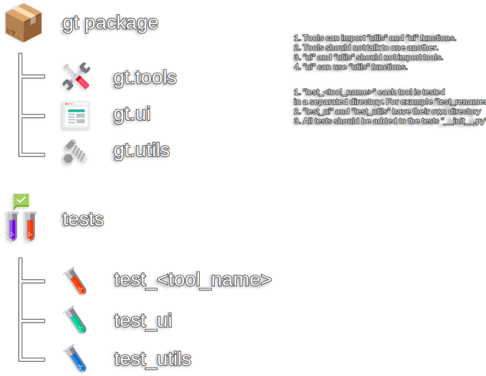

# Contributing to GT-Tools

We highly appreciate your input! We want to make contributing to this project as easy and transparent as possible, whether it's:

- Creating new tools
- Reporting a bug
- Submitting a fix
- Proposing new features
- Becoming a maintainer

## Develop with Github

We use Github to host code, to track issues and feature requests, as well as accept pull requests.

## Use [Github Flow](https://docs.github.com/en/get-started/quickstart/github-flow), So All Code Changes Happen Through Pull Requests

Pull requests are the best way to propose changes to the codebase (we use [Github Flow](https://docs.github.com/en/get-started/quickstart/github-flow)). We actively welcome your pull requests:

1. Fork the repo and create your branch from `dev`.
2. If you've added code that should be tested, add tests.
3. If you've created a new tool, update the documentation.
4. Ensure the test suite passes and add the results to your push request.
5. Issue a pull request!

### Push Request (PR) Reviews and Test Results:
To ensure smooth integration and to minimize conflicts, it is ideal to include test results with the push request. 
 This practice allows the reviewer to quickly determine that the code doesn't affect other elements of the package. 
 By providing the test results, you are demonstrating a proactive approach to maintain code integrity.

1. Add any new unittests to the tests [`__init__.py`](./tests/__init__.py) under the list "modules_to_test"
2. Run all tests; The output will be a text result formatted for Github (Markdown). 
3. Copy and paste the results as a comment on your PR.

## Report bugs using Github's [issues](https://github.com/TrevisanGMW/gt-tools/issues)

We use GitHub issues to track public bugs. Report a bug by [opening a new issue](https://github.com/TrevisanGMW/gt-tools/issues/new/choose); Your contribution is invaluable to us!

**Great Bug Reports** tend to have:

- A quick summary and/or background
- Steps to reproduce
  - Be specific!
  - Include version used
  - Include system specs
- What you expected would happen
- What actually happens
- Notes (possibly including why you think this might be happening, or stuff you tried that didn't work)

We **love** detailed bug reports!

## Code Style

- The code style should follow the [PEP8](https://github.com/google/styleguide/blob/gh-pages/pyguide.md#38-comments-and-docstrings) patterns as often as possible.
- Docstring format used is [Google Docs](https://github.com/google/styleguide/blob/gh-pages/pyguide.md#38-comments-and-docstrings). Arguments and returns should be included whenever possible.
- Make sure to add new utilities and user interface functions and classes to the correct script categories.  For example, if it's an animation class/function, add it to "anim_utils.py" so it can be easily found.
- Follow [best practices](https://refactoring.guru/refactoring/smells), such as avoiding bloated code, or minimizing coupling between components.
- Use Python, other languages should only be used if an option in Python is not available.
- When creating new tools, try to use a known pattern, for example: the [Model-View-Controller](https://en.wikipedia.org/wiki/Model%E2%80%93view%E2%80%93controller) design pattern.
 In case you prefer to use a less known or unique pattern, just make sure to keep the GUI separated from the Logic.
- Everything should be tested as much as possible. Create [unittests](https://docs.python.org/3/library/unittest.html) for all new functions, use the existing ones as example.

## Package Structure

1. Tools can import “utils” and “ui” modules and should avoid defining functions that can be shared with other tools.
2. Tools should not call one another, unless the main purpose of a tool is to interact with other tools.  For instance, a tool that searches, lists or create shortcuts for other tools (this should happen dynamically).
3. The "ui" and "utils" modules should not import any tools.
4. The tests for “test_ui” and “test_utils” have their own directory and should not receive distinct folders for each script.
5. Each tool is tested in a separated directory with the following name pattern: “test\_<tool-name>”. e.g. “test_renamer”.
6. All new test modules should be added to the tests `__init__.py` so they participate in the "run all tests" function.
7. Not sure where to start? Use the example tool as inspiration. It can be found under the following path: "[./gt/tools/sample_tool](./gt/tools/sample_tool)".
 This example uses the MVC Pattern, but you can use other patterns too, as long as the GUI is separated from the logic.

## Naming branches
Please use a descriptive pattern when creating branches:
 `<source-branch>-<category>/<description>` 

**"source-branch"** : Name of the branch used as starting point
 **"category"** : Category for the work in the new branch
 **"description"** : Branch description (issue number, topic, purpose)

### Category Words:

| Category | Meaning                                                   |
|----------|-----------------------------------------------------------|
| hotfix   | fixing critical issues, usually with a temporary solution |
| bugfix   | for fixing a bug                                          |
| feature  | for adding, removing or modifying a feature               |
| test     | for experimenting something                               |
| wip      | for a work in progress                                    |

### Examples:

- `dev.feature/123-add-skin-update`
- `dev.bugfix/100-fix-import-issue`
- `dev.test/new-export-method`
- `dev.wip/updating-docs`

## Versioning

When describing a tool version, use semantic versioning. Such as **MAJOR.MINOR.PATCH**

- **MAJOR**: Big changes that might be incompatible with older versions.
- **MINOR**: Significant changes, like adding new features.
- **PATCH**: Small changes used to fix issues or improve existing scripts.

Include the version as a variable in the `__init__.py` file that is used to initialize the tool.
The variable name should be `__version__` of the type string. (See package init for an example)

## License

By contributing, you agree that your contributions will be licensed under its [MIT License](http://choosealicense.com/licenses/mit/).
