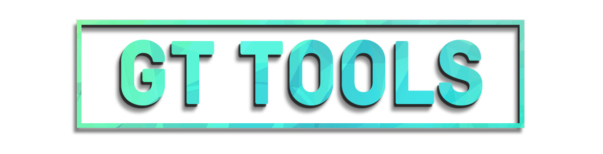
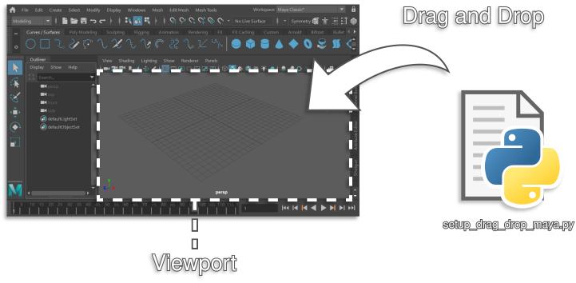
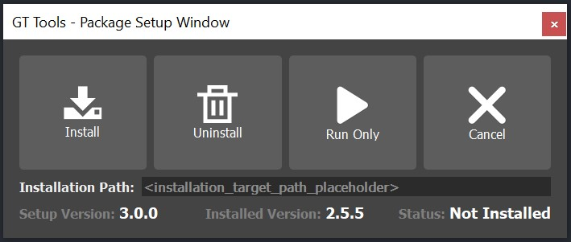

<!-- GT Tools README.md file -->

    

    
    
    
    
    
    
    
    

## Description

GT Tools is a collection of tools and Python scripts designed to automate workflows, enhance existing features, and fill gaps in Autodesk Maya.

After the package is installed and loaded, a drop-down menu provides access to the available tools and utilities. The menu is organized into submenus containing related tools, such as modeling, rigging, and utility tools.

For help using the scripts, click the **Help** button in the top-right corner of the Maya window or browse the [documentation](./docs). For the changelog, see the [release page](https://github.com/TrevisanGMW/gt-tools/releases).

All items are provided "as is." You are responsible for how you use them and for any issues that may result. I hope these scripts are useful to you.

**Package tested with Autodesk Maya 2025, 2026, and 2027 on Windows 11.**

## Organization

- `docs`: Documentation for installing, using, and troubleshooting the package.
- `gt`: Main Python package.
- `gt.core`: Reusable core logic for common operations. Core modules are intended to be shared by multiple tools..
- `gt.tools`: User-facing tools. Each tool is generally organized in its own package and combines core logic, utilities, and UI components.
- `gt.ui`: Shared user-interface components, wrappers, widgets, styles, and resources.
- `gt.utils`: Shared supporting utilities for tasks such as file handling, system operations, exporting, and DCC integration.
- `gt.tests`: Unit and regression tests for core modules, utilities, UI components, and tools. See [CONTRIBUTING](./CONTRIBUTING.md) for more details.

## Setup (Install, Uninstall, Run Only)

**TL;DR:** Download and extract the package, then drag `setup_drag_drop_maya.py` onto the Maya viewport. The setup window lets you choose **Install**, **Uninstall**, or **Run Only**.

1. Open Maya.
2. Download the [latest release](https://github.com/TrevisanGMW/gt-tools/releases), or clone the repository.
3. Extract the downloaded archive. The setup script will not work while the archive is still compressed.
4. Drag `setup_drag_drop_maya.py` onto the Maya viewport.
5. Choose the desired operation: **Install**, **Uninstall**, or **Run Only**.
6. Follow the instructions shown in the setup window.

After installation, you can delete the downloaded or extracted source files if they are no longer needed; the package files have already been copied to the installation path.

### Setup Window

- **Install:** Copies the package files to the installation path and loads (or reloads) the package.
- **Uninstall:** Removes the installed package files and unloads the package.
- **Run Only:** Loads the tools from their current location without copying them to the installation path. This is useful for temporary use or testing.

### Checksum Verification

During the first installation, Maya may display a small dialog titled **UserSetup Checksum Verification**. Select **Yes** to continue. The dialog indicates that the `userSetup.mel` startup script was modified as part of the installation. This is an Autodesk security feature that informs you when the startup script changes.

## Updating

The package can be updated automatically from Maya using the **Package Updater** tool. Open the updater from the drop-down menu to check for new releases. If an update is available, use the **Update** button to download and install the latest version.

For a major version update, uninstalling the existing version before installing the new one is recommended because it removes extra files that are no longer needed. If you update the package manually, make sure to overwrite the existing files when copying the new version.

## Contributing

If you would like to contribute, see [CONTRIBUTING](./CONTRIBUTING.md) for details. Pull requests are welcome.

    

## Licensing

GT Tools is distributed under the [MIT License](./LICENSE).

Copyright 2020 Guilherme Trevisan.
