<!-- GT Tools Docs -->

<body>

<!-- Table of Contents -->

<h1> Table of Contents</h1>

<h3><b>General:</b></h3>
<ul>
  <li><a href="#package-setup">Package Setup</a></li>
  <li><a href="#gt-menu">GT Menu</a></li>
  <li><a href="#gt-check-for-updates">GT Check for Updates</a></li>
</ul>
<h3><b>Tools:</b></h3>
<ul>
  <li><a href="#gt-renamer">GT Renamer</a></li>
  <li><a href="#gt-outliner-sorter">GT Outliner Sorter</a></li>
  <li><a href="#gt-selection-manager">GT Selection Manager</a></li>
  <li><a href="#gt-path-manager">GT Path Manager</a></li>
  <li><a href="#gt-color-manager">GT Color Manager</a></li>
  <li><a href="#gt-transfer-transforms">GT Transfer Transforms</a></li>
  <li><a href="#gt-world-space-baker">GT World Space Baker</a></li>
  <li><a href="#gt-render-checklist">GT Render Checklist</a></li>
</ul>
<h3><b>Curves:</b></h3>
<ul>
  <li><a href="#gt-extract-python-curve">GT Extract Python Curve</a></li>
  <li><a href="#gt-generate-text-curve">GT Generate Text Curve</a></li>
  <li><a href="#gt-extract-curve-state">GT Extract Curve State</a></li>
</ul>
<h3><b>Modeling:</b></h3>
<ul>
  <li><a href="#gt-transfer-uvs">GT Transfer UVs</a></li>
  <li><a href="#gt-sphere-types">GT Sphere Types</a></li>
</ul>

<h3><b>Rigging:</b></h3>
<ul>
  <li><a href="#gt-biped-auto-rigger">GT Biped Auto Rigger</a></li>
  <li><a href="#gt-biped-rig-interface">GT Biped Rig Interface</a></li>
  <li><a href="#gt-retarget-assistant">GT Retarget Assistant</a></li>
  <li><a href="#gt-game-fbx-exporter">GT Game FBX Exporter</a></li>
  <li><a href="#gt-extract-bound-joints">GT Extract Bound Joints</a></li>
  <li><a href="#gt-connect-attributes">GT Connect Attributes</a></li>
  <li><a href="#gt-morphing-utilities">GT Morphing Utilities</a></li>
  <li><a href="#gt-morphing-attributes">GT Morphing Attributes</a></li>
  <li><a href="#gt-mirror-cluster-tool">GT Mirror Cluster Tool</a></li>
  <li><a href="#gt-generate-in-between">GT Generate In-Between</a></li>
  <li><a href="#gt-create-auto-fk">GT Create Auto FK</a></li>
  <li><a href="#gt-create-testing-keys">GT Create Testing Keys</a></li>
  <li><a href="#gt-make-ik-stretchy">GT Make IK Stretchy</a></li>
  <li><a href="#gt-add-sine-attributes">GT Add Sine Attributes</a></li>
</ul>
<h3><b>Utilities:</b></h3>
<ul>
  <li><a href="#gt-utilities">GT Utilities</a></li>
</ul>
<h3><b>Miscellaneous:</b></h3>
<ul>
  <li><a href="#gt-startup-booster">GT Startup Booster</a></li>
  <li><a href="#gt-fspy-importer">GT fSpy Importer</a></li>
  <li><a href="#gt-maya-to-discord">GT Maya to Discord</a></li>
  <li><a href="#gt-render-calculator">GT Render Calculator</a></li>
</ul>

<!-- Package Setup -->

<h1>Package Setup</h1>

<h3>Setup - Installation, Uninstallation, or Run Only</h3>

<b>TL;DR:</b> Download and extract the files; Drag and drop the file "setup_drag_drop_maya.py" onto the Maya viewport; 
Select the option "Install", "Uninstall" or "Run Only"; Enjoy!  

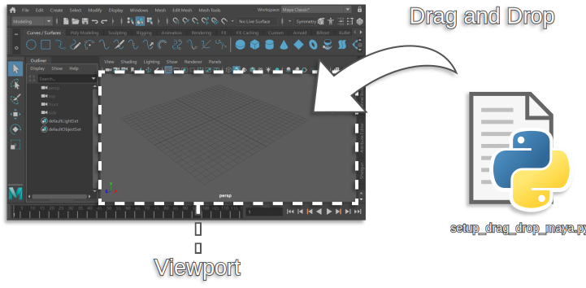

This script collection comes with an auto setup tool ("setup_drag_drop_maya.py") to call it drag and drop the file on your Maya viewport. From the setup window you can "Install", "Uninstall" or "Run Only".
 Here is how you do it in more details:

<ol>
	<li>Open Maya (in case it's closed).</li>
	<li>Download the latest release (or clone this repository).</li>
	<li>Un-zip (Decompress) the file you downloaded. (the setup won't work if it's still compressed)</li>
	<li>Drag and drop "setup_drag_drop_maya.py" on to your Maya viewport.</li>
    <li>An user interface with the setup options will open.</li>
	<li>Select the desired operation. E.g. "Install", "Uninstall", or "Run Only"</li>
	<li>Enjoy!</li>
</ol>

Here is an image of the setup window (installer) for reference:
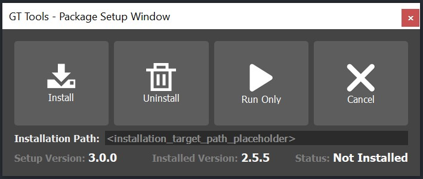

After installing, you can delete the downloaded/extracted files (as they have already been copied)

<h3>Checksum Verification</h3>

When installing it for the first time, Maya might show you a small dialog window saying "UserSetup Checksum Verification", you can confirm it with a "Yes". This window is only letting you know that the "userSetup.mel" script was modified. This is a security feature from Autodesk that is used to tell the user that the startup script was modified. This check is used to prevent infected scenes from modifying the startup script without the user knowing. In our case, we did it deliberately as part of the installation process, so you can just confirm it.

<h3>Run Only</h3>

The setup window offers the option to run the tools without installing them. To do this, follow the same drag and drop steps and click on "Run Only" instead of "Install". This is going to load the tools from the location you have them, allowing you to run it one time only.

<h3>Updating</h3>

Simply install it again. The auto setup will handle the file changes.
 If updating a major version, it's recommended that you uninstall it first before installing it again. This will eliminate any unnecessary files.
 In case updating it manually, make sure to overwrite (replace) the files when moving them.

<h3>Windows Only - Express Launcher</h3>

Users running windows can also use the <b>"setup_express_launcher.bat"</b> file to run setup options without opening Maya. 
 The same file can be used with arguments to run a launching option directly. For example, a shortcut with the argument 
<b>"-launch"</b> ("..\setup_express_launcher.bat -launch") will open Maya directly with the option "Run Only" from the GUI Setup window, essentially creating a shortcut to use the tools without installing them.

<!-- Dropdown Menu -->

<h1>GT Menu</h1>
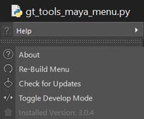

The package adds a dropdown menu to the main Maya window. It provides the user with easy access to the other scripts based on categories. 
 This menu contains sub-menus that have been organized to contain related tools. For example: modeling, rigging, utilities, etc...

<b>How does Maya know to run the script and create the menu?:</b>
 When you install the script package, it adds a line of code to the "userSetup.mel" file. This file gets executed every time Maya opens.

<b>Help > About: </b>
 This option opens a window showing basic information about GT Tools.

<b>Help > Re-Build Menu: </b>It re-creates the GT Tools menu, and does a rehash to pick up any new scripts.

<b>Help > Check for Updates: </b> Opens the script "gt_check_for_updates" to compare your version with the latest release.

<b>Help > Installed Version: </b>What version is currently installed.

 

<!-- GT Check for Updates -->

<h1>GT Check for Updates</h1>
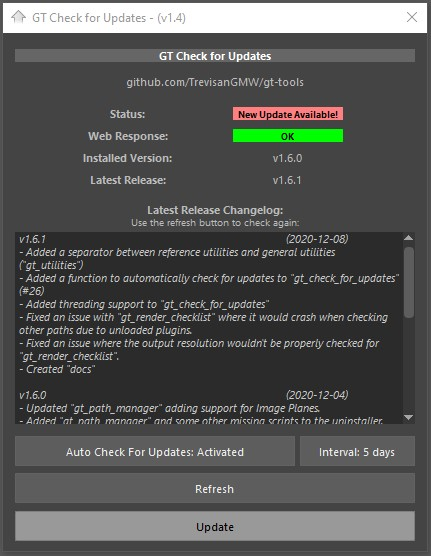

This script compares your current GT Tools version with the latest release from Github. In case the version installed is older than the latest release, an option to update becomes available. In this window you can also control how often the script will automatically check for updates.

<b>Status: </b> Result from the comparison. In case you have an older version it will let you know that the script package can be updated.

<b>Web Response: </b> The script needs to ask Github for the latest release to be able to compare with the one you have. In case internet is not available or a firewall blocked the connection you will see the error code here. (These are HTTP status codes)

<b>Re-Build Menu: </b>It re-creates the GT Tools menu, and does a rehash to pick up any new scripts. (Good for when updating, so you don't need to restart Maya)

<b>Installed Version: </b> Version currently installed on your computer. In case you never installed the menu, it will be (v0.0.0).

<b>Latest Release: </b>Latest version available on Github.

<b>Latest Release Changelog: </b>Here you can find a list showing all the main changes applied to the three latest versions. The version number can be found on the top left corner and the release date on the top right corner.

<b>Auto Check For Updates: </b>This function controls the behavior of the auto updater. In case active, it will use the interval value to determine if it should check for new releases. The user will only see the update window in case there is an actual update. (This function has no impact in your Maya startup time as it only gets executed only when necessary and it waits for the program to be idle. Click on the button to toggle between Activated/Deactivated

<b>Interval: </b>This is how often the script will auto check for updates. Click on the button to change between the available intervals. (5 day, 15 days, 30 days, 3 months, 6 months, 1 year)

<b>Refresh: </b>Checks for updates again.

<b>Update: </b>This button is only available in case there is a new update available. When clicked it opens the page for you to download the latest version. Simply install it again to update.

<b>Semantic Versioning: MAJOR.MINOR.PATCH</b>
<ul> 
	<li> <b>MAJOR</b>: Big changes that might be incompatible with older versions. </li>
	<li> <b>MINOR</b>: Significant changes, like adding new tools or big features. </li>
	<li> <b>PATCH</b>: Small changes used to fix issues or improve existing tools. </li>
</ul>

 

<!-- GT Renamer -->

<h1>GT Renamer</h1>
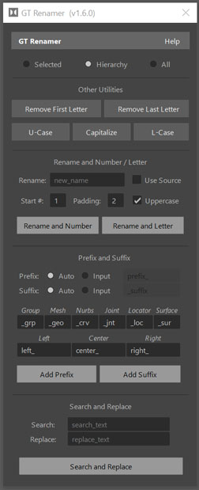
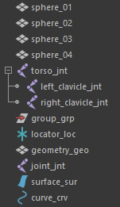

Script for quickly renaming multiple objects. Feedback is given through inView messages at the left bottom corner.

<b>Modes: </b> - Selected: uses selected objects when renaming. - Hierarchy: uses hierarchy when renaming. - All: uses everything in the scene (even hidden nodes)

<b>Other Tools: </b> - Remove First Letter: removes the first letter of a name. If the next character is a number, it will be deleted. - Remove Last Letter: removes the last letter of a name. - U-Case: makes all letters uppercase. - Capitalize: makes the 1st letter of every word uppercase. - L-Case: makes all letters lowercase

<b>Rename and Number / Letter: </b>Renames selected objects and add a number or a letter to them.
 - Use Source : Keeps the original name and only adds the number/letter.
 - Start # : first number when counting the new names.
 - Padding : how many zeros before the number. e.g. "001".
 - Uppercase : Makes the letter uppercase.

<b>Prefix and Suffix: </b> Prefix: adds a string in front of a name. Suffix: adds a string at the end of a name.  - Auto: Uses the provided strings to automatically name objects according to their type or position. 1st example: a mesh would automatically receive "_geo" 2nd example: an object in positive side of X, would automatically receive "left_: .  - Input: uses the provided text as a prefix or suffix.

<b>Search and Replace: </b>Uses the well-known method of search and replace to rename objects.

 

<!-- GT Outliner Sorter -->

<h1>GT Outliner Sorter</h1>
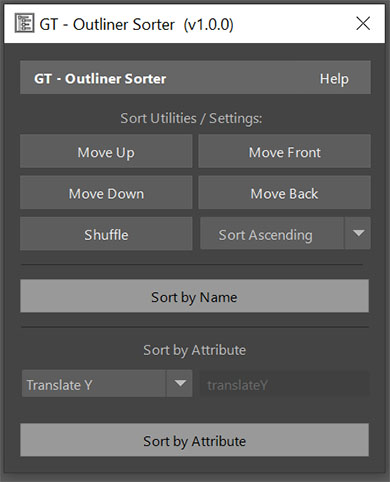

Script for sorting outliner hierarchies. Options will not re-parent objects, only change their order.

<b>Utilities / Settings: </b>
 - Move Up: Moves the selected objects up in the hierarchy order.
 - Move Down: Moves the selected objects down in the hierarchy order.
 - Move Front: Moves the selected objects to the top of the hierarchy order.
 - Move Back: Moves the selected objects to the bottom of the hierarchy order.
 - Shuffle: Randomizes the order of the selected objects.

<b>Sort Ascending/Descending:</b>
 Determines if the output of the operations will be in an increasing order or decreasing.

<b>Sort by Name: </b>
 - Re-order selected elements based on their names. For example:
 "Object_B", "Object_C", "Object_A", would become:
 "Object_A", "Object_B", "Object_C"
 This also works with numbers. It reads the letters from left to right.

<b>Sort by Attribute: </b>
 - Re-order selected elements based on an attribute. For example:
 "Object_B.ty" = 5, "Object_C.ty" = 10, "Object_A" = 1, would become:
 "Object_C.ty" = 10, "Object_B.ty" = 5, "Object_A" = 1 (matching the order of the values)
 You can also use user-defined/custom attributes by filling the text-field on top of the "Sort by Attribute" button.

 

<!-- GT Selection Manager-->

<h1>GT Selection Manager</h1>
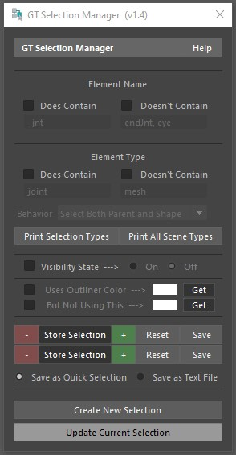

This script allows you to update selections to contain (or not) filtered elements. You can also save and load previous selections.
	 

<b>Element Name: </b>This option allows you to check if the string used for the object name contains or doesn't contain the, the provided strings (parameters).

<b>Element Type:  </b>This filter will check the type of the element to determine if it should be part of the selection or not.

<b>Element Type > Behavior (Dropdown Menu): </b>Since most elements are transforms, you can use the dropdown menu "Behavior" to determine how to filter the shape element (usually hidden inside the transform).  (You can consider transform, shape, both or ignore it)

<b>Visibility State: </b>Selection based on the current state of the node's visibility attribute.

<b>Outliner Color (Transform): </b>Filters the option under Node > Display > Outliner Color. In case you're unsure about the exact color, you can use the "Get" button to automatically copy a color.

<b>Store Selection Options: </b> Select objects and click on "Store Selection" to store them for later. Use the "-" and "+" buttons to add or remove elements. Use the "Reset" button to clear your selection.

<b>You can save your selection in two ways: </b> As a set: creates a set containing your selection.  As text: creates a txt file containing  the code necessary to recreate selection.

<b>Create New Selection: </b>Uses all objects as initial selection <b>Update Current Selection: </b>Considers only selected objects

 

<!-- GT Path Manager -->

<h1>GT Path Manager</h1>
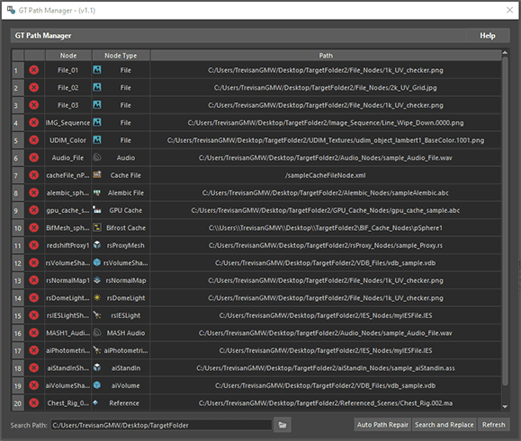
	 

This script displays a list with the name, type and path of any common nodes found in Maya.  You can select the node listed by clicking on it or change its name or path by double clicking the cell.

The icon on the left describes the validity of the path. If the file or directory is found in the system it shows a green confirm icon otherwise it shows a red icon.

<b>Auto Path Repair: </b>This function walks through the folders under the provided directory looking for missing files. If it finds a match, the path is updated.

<b>Search and Replace: </b>This function allows you to search and replace strings in the listed paths.

<b>Refresh: </b>Re-populates the list while re-checking for path validity.

<b>Search Path: </b>A directory path used when looking for missing files.

<b>Supported Nodes: </b>
 file (UDIMS and Image Sequences), audio, cacheFile, AlembicNode, BifMeshImportNode, gpuCache, MASH_Audio, aiPhotometricLight, aiStandIn, aiVolume, RedshiftProxyMesh, RedshiftVolumeShape, RedshiftNormalMap, RedshiftDomeLight, RedshiftIESLight, imagePlane

  

<!-- GT Color Manager -->

<h1>GT Color Manager</h1>

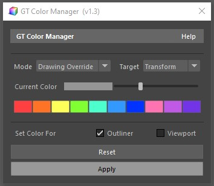

Script for quickly coloring elements in Maya. Feedback is given through inView messages at the left bottom corner.

 

<b>Modes: </b> - Drawing Override: Utilize "Object > Object Display > Drawing Overrides" to set color. - Wireframe Color:  Utilize "Display > Wireframe Color..." to set color.

 

<b>Target: </b> - Transform:  Colorize actual selection. Usually a "transform" - Wireframe Color:  Colorize the shape node inside the transform

 

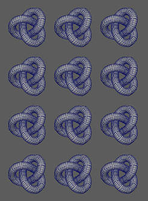
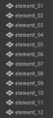

<b>Current Color: </b> The color used in the operation. Click on the color to open Maya's color picker.

<b>Color Presets: </b> A list of common colors. When clicked it sets the color.

<b>Set Color For: </b> - Outliner:  Control the outliner color
 - Wireframe Color:  Control the wireframe color seen in the viewport

     

<!-- GT Transfer Transforms -->

<h1>GT Transfer Transforms</h1>

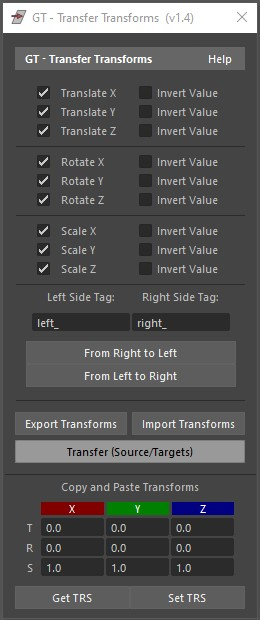

Script for transferring translate, rotate or scale data from one object to another.

<b>Transfer (Source/Targets): </b> 1. Select Source 1st - Wireframe Color:  Utilize "Display > Wireframe Color..." to set color.

<b>Target: </b> - Transform:  Colorize actual selection. Usually a "transform" 2. Select Targets 2nd,3rd... 3. Select which transforms to transfer (or maybe invert)

<b>Transfer from one side to the other: </b> "From Right to Left" and From Left To Right" functions.

1. Select all elements
 2. Select which transforms to transfer (or maybe invert)
 3. Select one of the "From > To" options
 e.g. "From Right to Left" :  Copy transforms from objects
with the provided prefix "Right Side Tag" to objects 
with the provided prefix "Left Side Tag".

<b>Copy and Paste Transforms: </b>
 As the name suggests, it copy transforms, which populates the text fields, or it pastes transforms from selected fields back to selected objects.

<b>Export and Import Transforms: </b>
 Exports a file containing Translate, Rotate, and Scale data for every selected object.
 When importing, it tries to find the same elements to apply the exported data.

 

<!-- GT World Space Baker -->

<h1>GT World Space Baker</h1>

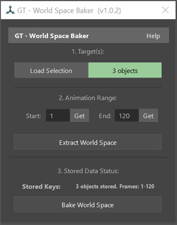

Script for storing then baking transforms using world-space data.

<b>1. Target(s) </b>
 Use "Load Selection" to define targets (objects to extract transform from).

<b>2. Animation Range </b>
 Enter animation range (Start & End). That's the range used by the script when extracting or baking transforms

<b>3. Extract World Space </b>
 Extract and store transforms; This creates a dictionary with the transforms of the loaded objects throughout the animation range.

<b>4. Bake transforms when necessary </b>
 Bake the transforms when necessary. For example, after updating the object's parent into another pose, you bake it forcing the loaded object to go back to the stored position (world-space)

    

<!-- GT Render Checklist -->

<h1>GT Render Checklist</h1>

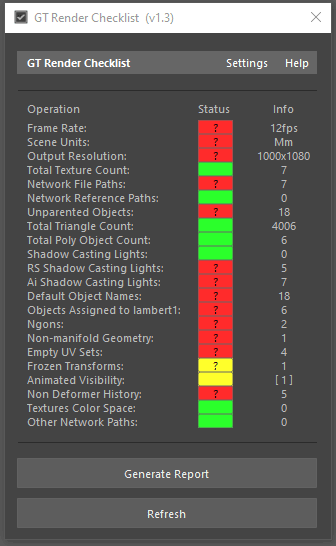

This script performs a series of checks to detect common issues that are often accidentally ignored/unnoticed.

<b>Checklist: </b>
 - Operation: Name of the check the script will perform
 - Status: Result received from the test
 - Info: Extra info or comments regarding the results

<b>Checklist Status: </b> These are also buttons, you can click on them for extra functions:
 - Grey: Default color, not yet tested.
 - Green: Pass color, no issues were found.
 - Yellow: Warning color, some possible issues were found.
 - Red: Error color, issues were found.
 - Black: Exception color, an issue caused the check to fail. (Likely because of a missing plug-in or unexpected value)
 - Question Mark, click on button for more help.

<b>Settings: </b>
 Change what values cause the script to return a warnings and errors.
 - Apply: Stores the settings and go back to the main window (settings are persistent between Maya sessions)
 - Export Settings: Exports a txt file containing all current settings.
 - Import Settings: Imports a txt file exported using the previously mentioned function.
 - Reset to Default Values: Resets expected values to default values.

<b>Main Buttons: </b>
 - Generate Report: Creates a temporary txt file with all the information collected during the checks.
 - Refresh: Runs all checks again.

<b>Checklist Operations:</b>

<ul>
	<li> Frame Rate: returns error if not matching expected frame rate, for example "film" (24fps).
		 Examples of custom values:"film" (24fps),"23.976fps", "ntsc" (30fps), "ntscf" (60fps), "29.97fps"
	</li>
	<li> Scene Units: returns error if not matching expected value, for example "cm".
		 Examples of custom values: "mm" (millimeter), "cm" (centimeter), "m" (meter).
	</li>
	<li> Output Resolution: returns error if not matching expected value, for example : ['1920', '1080'].
		 Please use a comma "," for entering a custom value. Examples of custom values: "1280, 720" (720p), "1920, 1080" (1080p), "2560, 1440" (1440p), "3840, 2160" (4K), "7680, 4320" (8K)
	</li>
	<li> Total Texture Count: error if more than expected value 50 (default value) and a warning if more than 40 (default value). (UDIM tiles are counted as individual textures)
	</li>
	<li> Network File Paths: must start with ['path']. Path is a list, you can enter all acceptable locations (usually in the network for render farms)
		 This function completely ignore slashes. You may use a list as custom value. Use a comma "," to separate multiple paths.
	</li>
	<li> Network Reference Paths: must start with ['path']. Path is a list, you can enter all acceptable locations (usually in the network for render farms)
		 This function completely ignore slashes. You may use a list as custom value. Use a comma "," to separate multiple paths
	</li>
	<li> Unparented Objects: returns an error if common objects are found outside hierarchies. For example a cube outside of a group.</li>
	<li> Total Triangle Count: : error if more than 2000000 (default value) warning if more than: 1800000 (default value).
	</li>
	<li> Total Poly Object Count: error if more than 100 (default value) warning if more than 90 (default value).
	</li>
	<li> Shadow Casting Lights: error if more than 3 (default value) warning if more than 2 (default value).
	</li>
	<li> RS Shadow Casting Lights: error if more than 4 (default value) warning if more than 3(default value).
	</li>
	<li> Ai Shadow Casting Lights: error if more than 4 (default value) warning if more than 3 (default value).
	</li>
	<li> Default Object Names: error if using default names. Warning if containing default names. 
		 Examples of default names: "pCube1" = Error, "pointLight1" = Error, "nurbsPlane1" = Error, "my_pCube" = Warning
	</li>
	<li> Objects Assigned to lambert1: error if anything is assigned to the default shader "lambert1".
	</li>
	<li> Ngons: error if any ngons are found. (A polygon that is made up of five or more vertices. Anything over a quad (4 sides) is considered an ngon)
	</li>
	<li> Non-manifold Geometry: error if is found. A non-manifold geometry is a 3D shape that cannot be unfolded into a 2D surface with all its normals pointing the same direction.
		 For example, objects with faces inside of it or faces with edges extruded out of it.
	</li>
	<li> Empty UV Sets: error if multiples UV Sets and Empty UV Sets. It ignores objects without UVs if they have only one UV Set.
	</li>
	<li> Frozen Transforms: error if rotation(XYZ) not frozen. It doesn't check objects with incoming connections, for example, animations or rigs.
	</li>
	<li> Animated Visibility: error if animated visibility is found warning if hidden object is found.
	</li>
	<li> Non Deformer History: error if any non-deformer history found.
	</li>
	<li> Textures Color Space: error if incorrect color space found. It only checks commonly used nodes for Redshift and Arnold
		 Generally "sRGB" -> float3(color), and "Raw" -> float(value).
	</li>
	<li> Other Network Paths: must start with ['path']. Path is a list, you can enter all acceptable locations (usually in the network for render farms)
		 This function completely ignore slashes. You may use a list as custom value. Use a comma "," to separate multiple paths.
		 This function checks: Audio Nodes, Mash Audio Nodes, nCache Nodes, Maya Fluid Cache Nodes, Arnold Volumes/Standins/Lights, Redshift Proxy/Volume/Normal/Lights, Alembic/BIF/GPU Cache, Golaem Common and Cache Nodes.
	</li>
</ul>
 

<!-- GT Extract Python Curve -->

<h1>GT Extract Python Curve</h1>

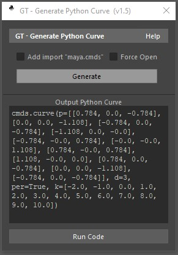

This script generates the Python code necessary to create a selected curve. Helpful for when you want to save a curve to your shelf or to add it to a script.

<b>How to use it:</b>
 1. Make sure you delete the curve's history before generating the code.
 2. Select the curve you want to convert to code.
 3. Click on the "Generate" button to generate the code.

<b>Add import "maya.cmds": </b> Adds a line that imports Maya's cmds API. This is necessary for when running python scripts.

<b>Force Open: </b> Doesn't check if the curve is periodic leaving it open.

<b>"Generate" button:</b> Outputs the python code necessary to create the curve inside the "Output PYthon Curve" box.

<b>Run Code: </b> Attempts to run the code (or anything written) inside  "Output Python Curve" box  

<b>Save to Shelf: </b> Saves the code (or anything written) inside "Output Python Curve" box as a shelf button.

 

<!-- GT Generate Text Curve -->

<h1>GT Generate Text Curve</h1>

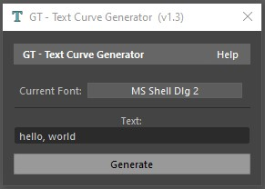

This script creates merged curves containing the input text from the text field.  (All shapes go under one transform)

<b>How to use it:</b>
 1. Select what font you want to use.
 2. Type the word you want to create in the "Text:" text field.
 3. Click on the "Generate" button.

You can create multiple curves at the same time by separating them with commas ",".

<b>Current Font: </b> Click on the button on its right to change the font

 

<!-- GT Extract Curve State -->

<h1>GT Extract Curve State</h1>

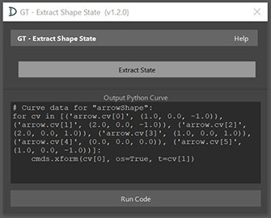

This script generates the Python code necessary to recreate a curve shape state.

<b>How to use it:</b>
 1. Select the curve (or curve's transform) you want to convert to code.
 2. Click on the "Generate" button to generate the code.

<b>"Extract State" button:</b> Outputs the python code necessary to recreate the current curve shape inside the "Output PYthon Curve" box.

<b>Run Code: </b> Attempts to run the code (or anything written) inside  "Output Python Code" box  

<b>Save to Shelf: </b> Saves the code (or anything written) inside "Output Python Code" box as a shelf button.

 

<!-- Transfer UVs -->

<h1>GT Transfer UVs</h1>

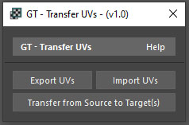

Script used to quickly transfer UVs between objects. It allows you to export or import UVs or transfer them from an object to other objects in the scene.  This script automatically bakes the UVs onto the intermediate object allowing you to transfer UVs without generating history.

<b>Export UVs: </b> Exports an OBJ file containing the model and its UVs (similar to simply exporting and OBJ file through the file menu)

<b>Import UVs: </b> Imports the previously exported OBJ file and transfers its UVs to the intermediate object of your selection. It allows you to import the UVs without generating history.

<b>Transfer from Source to Target(s) </b> Allows you to quickly transfer UVs from the first object in your selection to the other objects in the same selection. Thus, you first select your source, then your targets. This method will also use the intermediate object, so no construction history will be left behind.

 

<!-- GT Sphere Types -->

<h1>GT Sphere Types</h1>

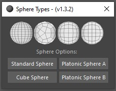

Quite simple script used as a reminder that the standard sphere is not the only sphere option.

<b>Standard Sphere: </b> Creates the standard Maya sphere. "Create > Polygon Primitives > Sphere"

<b>Standard Sphere: </b> Creates a sphere using a cube. "Create > Polygon Primitives > Cube" then "Mesh > Smooth (2x)"

<b>Platonic Sphere A: </b> Creates a sphere using a platonic solid. (Settings: Icosahedron, Quads, 1, 1, 1)

<b>Platonic Sphere A: </b> Creates a sphere using a platonic solid. (Settings: Octahedron, Quads, 2, 1, 1)

 

<!-- GT Biped Auto Rigger -->

<h1>GT Biped Auto Rigger</h1>

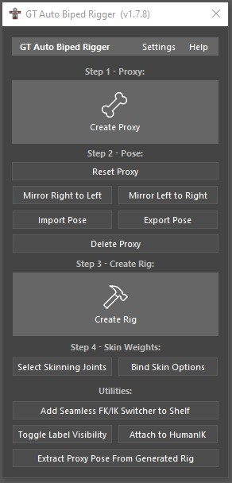

Script for quickly generating an advanced biped rig.
 For more predictable results execute the script in a new scene containing only the geometry of the desired character. This solves most naming conflicts and data loss issues. In case you want the auto rigger to manage your geometry, parent it under a group called "geometry_grp".
 In case you experience any issues with the rig, let me know through the "Issues" tab on Github. 
 

Here are some highlights of what it creates: 
<ul>
	<li> FK/IK switches with automated control visibility.</li>
	<li> Automated finger posing with offset (for a natural motion) </li>
	<li> A knuckle compression system so there are no gaps between the fingers.</li>
	<li> Abduction and Adduction for the fingers.</li>
	<li> Foot rolls (with manual limiters for more flexibility) </li>
	<li> Options to have pole vectors, IK controls and eyes follow parts of the body (like effectors) </li>
	<li> Stretchy and squash for the arms and legs (with automatic volume preservation) </li>
	<li> Automatic forearm rotation with support for stretched limbs.</li>
	<li> Shelf button with Seamless FK/IK Switch for arms and legs.</li>
	<li> Scalable controls that inflate/deflate the joints without affecting their children.</li>
	<li> Automatic HumanIK character definition with custom rig profiles for retargeting (mocap)</li>
	<li> Automatic breathing system without using expressions.</li>
</ul>

Tabs:  The tabs "Facial", "Corrective" and  "Settings" control optional rigging steps and work in a similar way to the base rig.

<h3>Step 1:</h3>
<b>- Create Proxy:</b> 
This button will create many temporary curves that will later be used to generate the rig. 
 In case you want to re-scale the proxy, use the root proxy control for that.
 The initial scale is the average height of a woman (160cm) but you can download proxy presets (poses) for other scales from the  <a href="./assets">assets folder</a>.
 
  The arrow found in the shape of the clavicles, hands and finger proxies indicate their up position. 
 The bigger arrows in the shape of the knees and elbows show the direction of their up vector constraint. (that's the direction they will bend)
 
 To position the eye proxies: Center the pivot point of the eye geometry then display its Local Rotation Axes then snap the proxy to its center.
 To center the pivot of eye geometry go to <b>"Modify > Center Pivot"</b> (It's often already in the center, check it first)
 To show the Local Rotation Axes (so you have a point to snap it to) go to <b>"Display > Transform Display > Local Rotation Axes"</b>
 Hold "V" while moving the eye proxy to snap it to points. 
 
 Some proxy curves have custom attributes on them that allow you to tweak their posing behavior or visibility. 
 The ankle proxy curves have an attribute called "Follow Hip" when activated, they will follow the position of the hip allowing you to pose the character a bit faster while keeping a hip and ankle perfectly aligned.
 The Root proxy has an attribute called "Lines Visibility" that allows you to turn off the visibility of the lines
 
 Proxy curves are not joints. Please don't delete or rename them. 
 For tips on how to position every proxy curve, open the attribute editor and read the information under "Transform Node > Notes:"

<h3>Step 2:</h3>
Pose the proxy (guide) to match your character. 
 <b>- Reset Proxy:</b>  Resets the position and rotation of the proxy elements, essentially "recreating" the proxy.  
 <b>- Mirror Right to Left:</b> Copies the transform data from the right side to the left side, mirroring the pose.
 <b>- Mirror Left to Right:</b> Copies the transform data from one left side to the right side, mirroring the pose.
 <b>- Import Pose:</b> Imports a JSON file containing the transforms of the proxy elements. This file is generated  using the "Export Pose" function. 
 <b>- Export Pose:</b> Exports a JSON file containing the transforms of the proxy elements. 
 <b>- Delete Proxy:</b> Simply deletes the proxy in case you no longer need it.

<h3>Step 3:</h3>
<b>- Create Rig:</b> This button uses the proxy elements to automatically create the control rig.
 It uses the transform data found in the proxy to determine how to position, orient and setup the skeleton and controls.
 This function will delete the proxy. Make sure you export it first if you plan to reuse it later. 

<h3>Step 4:</h3>
Now that the rig has been created,  it's time to to attach it to the geometry.
 <b>- Select Skinning Joints:</b>  Select only joints that should  be used when skinning the character. This means that it will not include end or toe joints. If you don't plan to include the eyes joints in the influences of the character's body, simply unselect them before skinning.
 <b>- Bind Skin Options:</b>  Opens the options for the function "Bind Skin" so the desired geometry can attached to the skinning joints. Make sure to set the option "Bind to" as "Selected Joints" to guarantee that only the desired joints are part of the influence. 

 

<h3>Utilities:</h3>

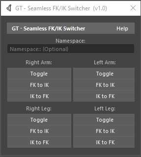

These are utilities and extra functions that you can use after creating your rig.
 
 <b>- Add Seamless FK/IK Switch to Shelf:</b> Adds a new button to your current shelf. This button allows the animator to seamlessly switch between FK and IK for the arms and legs.
 <b> - Toggle:</b> Seamlessly Toggles between FK and IK.
 <b> - FK to IK:</b> Switches to IK and copies the FK pose into it.
 <b> - IK to FK:</b> Switches to FK and copies the IK pose into it.
 
 <b>- Toggle Label Visibility:</b> Uniformly toggles the option "Joint > Joint Labelling > Draw Label" (".drawLabel") for all joints in the scene (according to the state of the majority of them).
 
 <b>- Attach to HumanIK:</b> Automatically creates a HumanIK character definition called "auto_biped" and assign all the available joints/bones to it. In case a character with the same name is already present in the scene, it will be overwritten.
 
 <b>- Extract Proxy Pose From Generated Rig:</b> Attempts to extract the proxy pose from a generated rig. This function can't account for the scale set to the "root_proxy" as it gets baked when the rig is generated, so it should only be used in case you forgot to export the proxy pose during the creation of the character.

 
<h3>Example of seamless FK/IK switch being used:</h3>

  <h3>How to attach motion capture data to the rig through HumanIK:</h3>
<b>- 1.</b> Start by defining a character and assigning all bones to the definition (You can do that in one click using the utility "Attach to HumanIK")
 <b>2.</b> Create a custom rig by clicking on the custom rig button. 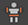
 <b>3.</b> Assign the desired controls or use one of the provided templates so HumanIK knows what controls to update. 
 You can load a template by clicking on the button "Load Custom Rig Mapping".  Templates can be found in the <a href="./assets">assets folder</a>.
 <b>4.</b> Now you can source the motion from another character like you would normally do in HumanIK and it should automatically reverse engineer the control position to match the mocap data.
 In case the elbows or knees pole vector controls give you trouble, you might be able to fix it using their custom attribute "Follow Foot" or "Follow Wrist" instead of relying on HumanIK to position it. <a href="https://youtu.be/eBwYi8FeK3I">This video</a> explains in more details how this process works.
 <b>5.</b> Now you can bake the movements to the custom rig by going to "HumanIK Button (blue button) > Bake > Bake to Custom Rig".
 Feel free to delete the HumanIK character definition and mocap data after that as the keyframes are now already baked to the controls.

<h3>Lock Attribute and Follow Object:</h3>
This rig comes with many custom attributes so you can tweak how much stability/flexibility you want and how the systems should behave.

<b>- Lock Attribute</b>: Many controls come with channels automatically locked so they behave in an expected way, but in certain situations you might want to unlock these so you have more flexibility. For this, you can just change the "Lock ATTR" (ATTR could be channels TRS, XYZ) custom attribute. A good example is the foot rolls. They have their Y and Z rotations locked by default, but in case you want to rotate the foot in another direction you can change "Lock YZ" to "Off". 

<b>- Follow Object</b>: A few controls give you the option to follow other controls or move on their own. These are the pole vector controls (such as the IK knees and IK elbows) and the eye controls. Below you can see an example of the eye controls following or not the head. 

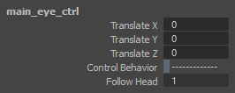

<h3>FK/IK Switch Control, Stretchy System, and Finger Automation:</h3><b>- FK/IK Switch</b>: To control which system is currently active, just change the value in the attribute "Influence Switch" (".influenceSwitch"), when set to "0" (Zero) the rig uses forward kinematics (FK) when set to "1" (One) it uses inverse kinematics (IK). By default the visibility of the controls is automatically managed, but in case you want to control it manually, you can deactivate the attribute "Auto Visibility" and pick which one you want to see through the attribute "System Visibility". 

<b>- Stretchy Attributes</b>: The custom attributes to control how the stretchy system behaves can be found under the FK/IK Switch Controls. In order to use the stretchy system the rig must be configured to to "IK".
<ul>
	<li><b>Stretch:</b> Controls the amount of influence the stretch system has.</li>
	<li><b>Squash:</b> Controls the amount of influence the squash system has. If activated the IK joints will no longer bend as they will become smaller.</li>
	<li><b>Stretch From Source:</b> Whether or not the system should stretch from the base of the IK system.</li>
	<li><b>Save Volume:</b> This will automatically attempt to shrink or inflate the joints in the middle of the IK system to simulate the loss or gain of volume.</li>
	<li><b>Base Volume Multiplier:</b> Controls how much of the "Save Volume" output should be transferred to the base of the IK system.</li>
	<li><b>Minimum Volume:</b> Controls the minimum save volume scale value allowed for the joints in the stretchy system. "0.4" would be 40% of its original scale.</li>
	<li><b>Maximum Volume:</b> Controls the maximum save volume scale value allowed for the joints in the stretchy system. "2" would be double of its original scale.</li>
</ul>

<b>- Finger Automation</b>: To pose the fingers more conveniently, you can use the finger controls. These will automatically rotate all the fingers according to the provided parameters.
<ul>
	<li><b>Activate System:</b> Simply turn the automatic rotation of the fingers on or off.</li>
	<li><b>Fist Pose Limit + Finger Name:</b> Determines the rotation considered the fist pose. It limits the rotation of the fingers so it stops at this value.</li>
	<li><b>Rot Multiplier + Finger Name:</b> How much of the rotation will be transferred to the finger. This offset helps create a more natural motion.</li>
</ul>

 

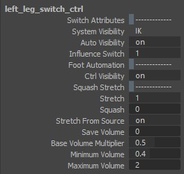
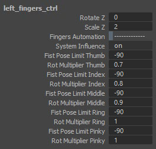

 

<h3>Auto Breathing, Abduction/Adduction, and Knuckles Compression Systems:</h3>
<b>- Auto Breathing</b>: Causes the spine and clavicles joints to scale/translate up and down in a breathing rhythm. To control this system you can use the attributes found under the "main_ctrl". 
<ul>
	<li><b>Breathing Time:</b> Amount of time transferred to the auto breathing system.</li>
	<li><b>Breathing Amplitude:</b> Maximum amount of air going in (peak of the wave).</li>
	<li><b>Breathing Frequency:</b> How often the character breaths in and out.</li>
	<li><b>Breathing Offset:</b> Value added after operation is calculated.</li>
	<li><b>Max Scale + Spine Joint:</b> Maximum value allow for the scale .</li>
	<li><b>Max Scale + Clavicle Joint:</b> Maximum value allow for the translation Y of the clavicles .</li>
</ul>

 

<b>- Abduction/Adduction System:</b>: You can control the abduction and adduction actions for the fingers by scaling the "finger_ctrl" in "Z".
<ul>
	<li><b>Arrow Visibility:</b> Whether or not the template arrow (abduction/adduction feedback) is visible.</li>
	<li><b>Abduction Influence:</b> How much influence the system has over the fingers.</li>
	<li><b>Rot Multiplier + Finger:</b> Direction and amount of rotation.</li>
</ul>

 

<b>- Auto Knuckles Compression:</b>: The auto knuckles compression system will make the knuckle joints (thumb01, index01...) move closer to one another as the hand closes in order to prevent gaps between the fingers.
<ul>
	<li><b>Auto Compression:</b> Influence of the knuckles auto compression system.</li>
	<li><b>Compression Amount:</b> Multiplier for the knuckles compression system.</li>
	<li><b>Trans Multiplier + Finger:</b> Direction and amount of translation.</li>
</ul>

 

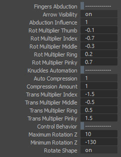
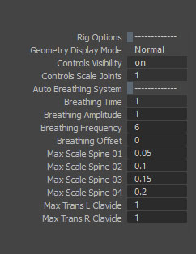

<h3>Settings:</h3>
<ul>
	<li><b>Use Real-time Skeleton:</b>  Creates another skeleton without the parameter "Segment Scale Compensate" being active. This skeleton inherits the transforms from the controls while mimicking the behavior of the "Segment Scale Compensate" option, essentially creating a baked version of this Maya depended system.
	As this baked version does not yet fully support non-uniform scaling, it's recommended that you only use it if you are planning to later send this rig into a game engine or another 3d application. This will allow you to preserve the stretchy settings even in programs that do not support it.</li>
</ul>

<h3>Imports/Exporting Skin Weights:</h3>
This might be obvious, but when exporting and importing skin weights, don't forget to include all influences before importing it. This can be done by clicking on "Select Skinning Joints" then adding them as influences through "Rigging > Skin > Edit Influences > Add Influence"
 

<h3>Mirror Skin Weights with ngSkinTools:</h3>
If painting the skin weights with "ngSkinTools" (third party plugin) you might have to manually map some of the finger influences before mirroring it. This can be done through "ngSkinTools > Mirror > Influences Mapping > Edit influence associations... > Link, both ways" 

 

<h3>Auto Rigger Work Sample:</h3>

Below you can watch a few animations that used GT Biped Auto Rigger to rig their characters.

<ul>
	<li><b>Home Remedy - Animated Short Film:</b> <a href="https://vimeo.com/579130303">vimeo.com/579130303</a></li>
	<li><b>Art in the time of Corona:</b> <a href="https://youtu.be/TtYRudIZBGQ?t=2023">youtu.be/TtYRudIZBGQ</a> <a href="https://vimeo.com/564743576">vimeo.com/564743576</a></li>
	<li><b>Short Horror Animation:</b> <a href="https://youtu.be/pH62aGjf9-Y?t=1198">youtu.be/pH62aGjf9-Y</a></li>
</ul>

Do you want to share your animation here? Send me a message! 

 

<!-- GT Biped Rig Interface -->

<h1>GT Biped Rig Interface</h1>

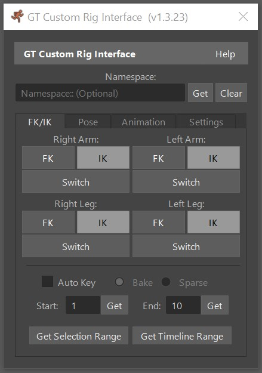

Extra functions and automation for rigs generated using GT Biped Auto Rigger.
 This script includes FK/IK Switchers, Pose managers, Animation managers and more.

<b>How to use it:</b>
 1. Under "Namespace:" click on "Get" to use the character's namespace. (In case you're not using a namespace, just click on "Clear")
 2. If the character is found, the FK/IK buttons will light up according to the current state.
 3. Use the desired function to animate or pose your character.

<h3>FK/IK Tab:</h3>
<ul>
	<li>
This is the FK/IK Switcher. When a button is colored light grey, it means that the system recognized its current state as FK or IK. Use Switch to toggle or click on the desired system to force it into that state. (Whatever pose found in one system will be copied into the other) 
	</li>
	<li><b>Auto Key:</b> When transitioning from one system to the other you might want an animation to drive the transition. That's what this button will help you accomplish. 
	<b>Bake:</b> Uses the provided range to bake every frame while rematching one system into the other
	 <b>Sparse:</b> Creates the first and last keys necessary to transition from one system to the other.
	 <b>Get Selection Range (Button):</b> Gets the range of your current selection (from the timeline).
	 <b>Get Timeline Range:</b> Gets the start and end frame from the beginning and ending of the timeline. Helpful when trying to transfer all data from one system to the other. When used in conjunction with the option "Key FK/IK Influence" (Under the Tab "Settings")

	</li>
</ul>

<h3>Pose Tab:</h3>
<ul>
	
Used to manage static poses. It doesn't key the character, only poses it.

	<li><b>Mirror:</b> Copies the transform data from one side of the rig into the other, mirroring its current pose.</li>
	<li><b>Reset Pose:</b> Resets the pose back to the rig default values.</li>
	<li><b>Import/Export Pose:</b> Allows you to import/export the current pose from/to a file.</li>

</ul>

<h3>Animation Tab:</h3>
<ul>
	
Used to manage static poses. It doesn't key the character, only poses it.

	<li>
		<b>Mirror:</b> Copies the animation data from one side of the rig into the other, mirroring its values.
	</li>
	<li>
		<b>Reset Animation:</b> Deletes keyframes and Resets the pose back to the rig default values.
	</li>
	<li>
		<b>Import/Export Animation:</b> Allows you to import/export the current animation from/to a file.
	</li>
</ul>

<h3>Settings Tab:</h3>
<ul>
	
Overall Settings for this script. These are persistent and will retain their values in between sessions.

	<li>
		<b>Allow Multiple Instances:</b> When active, you may open multiple instances of this script. Useful for when animating multiple character in the same scene.
	</li>
	<li>
		<b>Transfer Data to Offset Control:</b> Determines if the bake FK/IK data is transferred to the default Wrist/Ankle controls or their offset controls.
	</li>
	<li>
		<b>Key FK/IK Influence:</b> Creates a key in the influence values when switching between systems (FK/IK).
	</li>
	<li>
		<b>Reset Persistent Settings:</b> Resets current settings back to their default values.
	</li>
</ul>
 

<!-- GT Retarget Assistant -->

<h1>GT Retarget Assistant</h1>

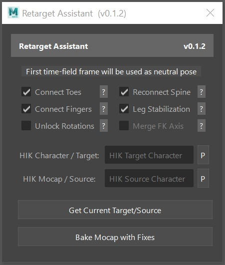

This script applies patches to a HumanIK Mocap character while it's been transferred to a Biped Rig (Created using GT Biped Auto Rigger)
 For this script to work, the target rig should have a custom rig defined under HumanIK.

<ul>
	
<b>Patches:</b>

	<li>
		<b>Connect Toes:</b> Uses the HumanIK data to create a constraint connection between the source ball joint and the biped rig ball joint. Essentially transferring the ball joint motion from the source (mocap) to the target (rig)
	</li>
	<li>
		<b>Reconnect Spine:</b>This option will replace the data received from HumanIK and transfer the rotation directly from the spine joints to the rig controls. 
		 WARNING: It might sometimes look funny or exaggerated because there is no scale compensation happening.
		To fix that, you can use the influence slider or compress/expand the entire animation till the desired result is achieved. (Found inside the "?" button)
	</li>
	<li>
		<b>Connect Fingers:</b>This option will extract the rotation of the finger joints that were defined through the HumanIK definition. If nothing was defined, nothing will be transferred. Much like the toe option, this option extracts whatever pose was left under the first frame of your timeline. Invert Finger Rotation: Makes the main rotation (usually "Z") rotate in the opposite direction, which can help motion capture skeletons with unexpected orientations become compatible. (Found inside the "?" button)
	</li>
	<li>
		<b>Leg Stabilization:</b>This option will use the IK rig to collect the correct rotation data from the position of the mocap skeleton. This helps enforce the correct foot placement.
	</li>
	<li>
		<b>Unlock Rotations:</b>WARNING: This option should not be used for all bakes.
		It will unlock all rotations allowing for the knee and elbow to receive rotation data into any axis. This might be desired in some cases when counter rotation is happening, but keep in mind that the data will lose some precision when transferred to IK,due to plane rotation nature of the IK solver. Consider using the option "Merge FK axis" to re-bake the FK controls back into one single plane rotation.
	</li>
	<li>
		<b>Merge FX Axis:</b>This patch can only be used when "Unlock Rotations" options is active. It transfers the data to IK causing the channels to merge and then transfer it back into FK, making the animation live into only one channel instead of multiple channels.
		Even though it might look slightly incorrect, it might give you data that is easier to handle, essentially eliminating some counter rotations.
	</li>
</ul>

<b>HIK Character/Target Text Field </b>  This is your final rigged character that will receive the animation. 

<b>HIK Mocap / Source Text Field </b>  This is the motion capture skeleton to be sourced into the rig. 

<b>"P" (Properties) buttons </b>  Selects the HumanIK properties of the character found in the text field. 

<b>Get Current Target/Source: </b> Populates the "HIK Character/Target" and "HIK Mocap / Source" text fields with the same data found under the HumanIK menu. 

<b>Bake Mocap with Fixes: </b> Bakes the Source character animation into the Target character while applying the active patches to the characters. 

 

<!-- GT Game FBX Exporter -->

<h1>GT Game FBX Exporter</h1>

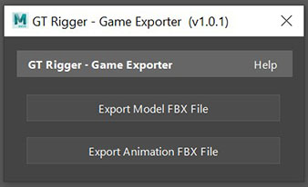

This script exports a biped rig into FBX while including only the necessary data for animation or model to work in a real-time engine. Any namespaces included in animation files (due to being references) are automatically stripped before exporting.

Generated FBX file uses real-time properties such as triangulation and SmoothingGroups and ContainerObjects

<ul>
	<li><b>Export Model FBX File:</b> Exports the main skeleton (joints under "root_jnt") and skinned geometry (found under "geometry_grp")
	 This option is equivalent to exporting the skinned version of the model without animation into a real-time engine. It includes some keyframe data into it to be used a neutral pose.</li>
	<li><b>Export Animation FBX File:</b> Exports the main skeleton (joints under "root_jnt") after baking any interpolating keyframe data into individual keyframes.
	 This option doesn't include the model, only the root skeleton. It should be used to export animation only. Any namespaces will be automatically stripped from the rig in the export.</li>
</ul>
 

<!-- GT Extract Bound Joints -->

<h1>GT Extract Bound Joints</h1>

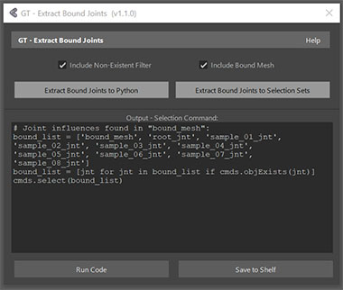

This script generates the Python code necessary to select all joints influencing a skinCluster node.

<b>How to use it:</b>
 1. Select bound meshes or surfaces.
 2. Click on the "Extract Bound Joints" button to generate the code.

<b>"Extract Bound Joints to Python" button:</b> Outputs the python code necessary to reselect the joints into the "Output PYthon Curve" box.

<b>"Extract Bound Joints to Selection Sets" button:</b> Saves the bound joints as selection sets instead of Python. One set per mesh. (May or may not include mesh, according to checkbox settings.

<b>Run Code: </b> Attempts to run the code (or anything written) inside  "Output Selection Command" box  

<b>Save to Shelf: </b> Saves the code (or anything written) inside "Output Selection Command" box as a shelf button.

 

<!-- GT Connect Attributes -->

<h1>GT Connect Attributes</h1>

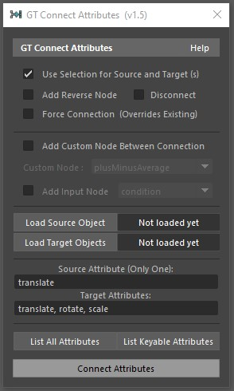

This script automates the creation of connections between attributes from source (output) and target (input).

<b>Use Selection for Source and Target (s): </b>
 When this option is activated, you no longer need to load sources/target (s).
 You can simply select: 1st: source, 2nd, 3rd... : target(s)

<b>Add Reverse Node:  </b> Adds a reverse node between connections.

<b>Disconnect: </b> Break connections between selected nodes.

<b>Force Connection (Overrides Existing): </b> Connects nodes even if they already have a connection.

<b>Add Custom Node Between Connection: </b>
 Allows user to create a node between connections. (Excellent for controlling dataflow.)
 -Custom Node: Which node to create
 -Add Input Node: Creates one master control to update all in betweens.

<b>Load Source/Target Objects: </b>
 Use these buttons to load the objects you want to use as source and target (s).

<b>Source Attribute and Target Attributes: </b>
 Name of the attribute you want to connect.  Requirement: Use long or short name (no nice names)

<b>List All Attributes and List Keyable Attributes: </b>
 Returns a list of attributes that can be used to populate the Source and Target Attributes fields.

 

<!-- GT Morphing Utilities -->

<h1>GT Morphing Utilities</h1>

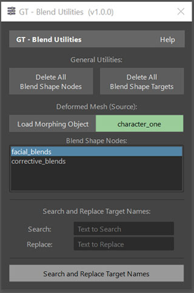

This script offers utilities to handle blend shape nodes and targets.

<b>Delete All Blend Shape Nodes:</b>
 Deletes all nodes of the type "blendShape" found in the opened Maya scene.

<b>Delete All Blend Shape Targets:</b>
 Deletes all targets found inside the scene's blend shape nodes, but leave the nodes behind.

<b>Load Morphing Object:</b>
 Determines the source of the morphing node. Runs basic validation and populates the scroll field with blend shape nodes found under the selected object.

<b>Blend Shape Nodes:</b>
 A list of the blend shape nodes found under the selected object.

<b>Search and Replace Target Names:</b>
 Allows you to search and replace strings used on blend shape target names (only the selected blend shape target will be affected).
	<ul>
		<li><b>Search:</b>  If the string is found in the text, it is replaced. (case sensitive)</li>
		<li><b>Replace:</b>  If found, the string is replace with the text provided here.</li>
	</ul>

<b>Search and Replace Target Names:</b>
 Runs search and replace operation.

 

<!-- GT Morphing Attributes -->

<h1>GT Morphing Attributes</h1>

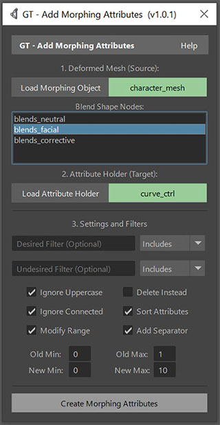

This script automates the creation of attributes used to drive blend shapes.

<b>Load Morphing Object:</b>
 Determines the source of the morphing node. Runs basic validation and populates the scroll field with blend shape nodes.

<b>Blend Shape Nodes:</b>
 Once the morphing object is loaded, this box shows a list of blend shape nodes. Click on the desired node to select it.

<b>Load Attribute Holder:</b>
 This is the object to receive the driving attributes. Usually a curve control.

<b>Desired Filter:</b>
 Strings in this text field will be included in the list of affected targets. 
 If empty, everything will be included. (multiple strings can be separated using  commas ","

<b>Undesired Filter:</b>
 Strings in this text field will be removed from the list of affected targets.
 If empty, filter will not take effect. (multiple strings can be separated using  commas ","

<b>Drop-down Menu (Includes, Starts With, Ends With)</b>: 
 These options determine how the desired or undesired strings will be filtered.
	<ul>
		<li><b>Includes:</b>  if the string is found in the text, it is accepted.</li>
		<li><b>Starts With:</b>  If found at the begging of the word, it is included.</li>
		<li><b>Ends With:</b>  If found at the end of the word, it\'s included.</li>
	</ul>

<b>Ignore Uppercase:</b>
 If active, the script will ignore the capitalization of the filter strings.',

<b>Add Separator:</b>
 If active, the script will also attempt to create a locked attribute to be used as a separator.
 Example - "Blends: "-------------"

<b>Ignore Connected:</b>
 If active, the script will ignore blend targets that already have incoming connections.

<b>Sort Attributes:</b>
 If active, the script will sort the list of attributes before creating them.

<b>Modify Range:</b>
 If active, the script will create an in-between node to remap the value according to what is provided under "old" and "new" minimum and maximum values

<b>Modify Range:</b>
 If active, the script will create an in-between node to remap the value according to what is provided under "old" and "new" minimum and maximum values

<b>Old Min/Max & New Min/Max:</b>
 This values are used for the remapping of the morphing attributes. Blend shapes are usually deactivated when as 0 and activated when at 1. If remapped to min: 0 and max: 10, the range would now be bigger but reflect the same values. For example 7.3 would actually load 0.73 of the blend target.

 

<!-- GT Mirror Cluster Tool -->

<h1>GT Mirror Cluster Tool</h1>

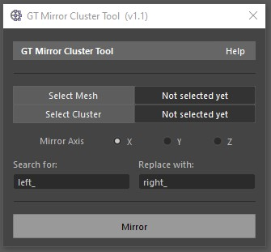

Script for mirroring clusters on mesh objects.

<b>Step 1: </b>
 Load your mesh by selecting it in the viewport or in the outliner,  then click on "Select Mesh".
 Requirements: Must be one single mesh transform.

<b>Step 2: </b>
 Load your clusterHandle by selecting it in the viewport or in the outliner,  then click on "Select Cluster".
 Requirements: Must be one single clusterHandle.

<b>Step 3: </b>
 Select your mirror axis X, Y or Z. It will always mirror on the negative direction

<b>Step 4: </b>
 To save time you can automatically rename the mirrored clusters using the search and replace text fields.
 For example search for "left_" and replace with "right_"

 

<!-- GT Generate In-Between -->

<h1>GT Generate In-Between</h1>

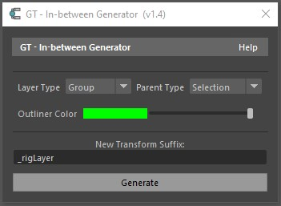

This script creates a inbetween transform for the selected elements.

<b>Layer Type: </b>
 This pull-down menu determines what type object will be created.

<b>Parent Type: </b>
 This pull-down menu determines where the pivot point of the generated element will be extracted from.

<b>Outliner Color: </b>
 Determines the outliner color of the generated element.

<b>New Transform Suffix: </b>
 Determines the suffix to be added to generated transforms.

 

<!-- GT Create Auto FK -->

<h1>GT Create Auto FK</h1>

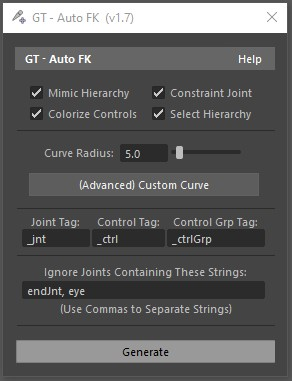

This script generates FK controls for joints while storing their transforms in groups.
 Just select the desired joints and run the script.

<b>Colorize Controls: </b>
 Automatically colorize controls according to their names (prefix). It ignores uppercase/lowercase.
 No Prefix = Yellow
 "l_" or "left_" = Blue
 "r_" or "right_" = Red

<b>Select Hierarchy:  </b>
 Automatically selects the rest of the hierarchy of the selected object, thus allowing you to only select the root joint before creating controls.

<b>(Advanced) Custom Curve: </b>
 You can change the curve used for the creation of the controls. Use the script "GT Generate Python Curve" to generate the code you need to enter here.

<b>Joint, Control, and Control Group Tag: </b>
 Used to determine the suffix of the elements.
 Joint Tag is removed from the joint name for the control.
 Control Tag is added to the generated control.
 Control Group Tag is added to the control group.
 (The control group is the transform carrying the transforms of the joint).

<b>Ignore Joints Containing These Strings:  </b>
 The script will ignore joints containing these strings. To add multiple strings use commas - ",".

 

<!-- GT Create Testing Keys -->

<h1>GT Create Testing Keys</h1>

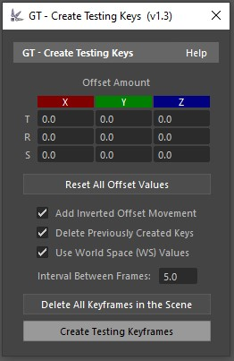

This script creates a sequence of keys with offset,
  usually used for testing controls or skin weights.

<b>How to use:</b>
 1. Select Target Object(s)
 2. Provide Offset Value(s)
 3. Create Testing Keyframes

<b>Offset Amount:</b>
 These are the values that will be added to the object.
 If set to "0.0" it will be ignored. (No keys will be created)

<b>Reset All Offset Values:</b>
 Resets all offset text fields to "0.0"

<b>Add Inverted Offset Movement:</b>
 Auto creates another key with the inverted offset value.
 For example, an offset of "1.0" will also create another offset at "-1.0"
 creating an oscillating movement like a sine function.

<b>Use World Space (WS) Values:</b>
 Moves objects as if they were not part of a hierarchy, which mimics the behavior of the world space.

<b>Delete Previously Created Keys:</b>
 Deletes all keys attached to the selected controls before creating new ones. 
 (Doesn't include Set Driven Keys)

<b>Create Testing Keyframes:</b>
 Creates keyframes according to the provided settings.

  

<!-- GT Make Stretchy Legs -->

<h1>GT Make IK Stretchy</h1>

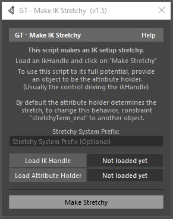

This script makes an IK setup stretchy.
 Load an ikHandle and an attribute holder then click on "Make Stretchy"
 To use this script to its full potential, provide an object to be the attribute holder. (Usually the control driving the ikHandle)

<b>Stretchy System Prefix:</b>
 As the name suggests, it determined the prefix used when naming nodes for the stretchy system. If nothing is provided, it will be automatically named "temp".

<b>Load IK Handle:</b>
 Use this button to load your ikHandle.The joints will be automatically extracted from it.

<b>Load Attribute Holder:</b>
 Use this button to load your attribute holder.
 This is usually a control. A few custom attributes will be added to this object, so the user can control the stretchy system.

 

<b>- Stretchy Attributes</b>: The attribute holder will receive custom attributes to control how the stretchy system behaves.
<ul>
	<li><b>Stretch:</b> Controls the amount of influence the stretch system has.</li>
	<li><b>Squash:</b> Controls the amount of influence the squash system has. If activated the IK joints will no longer bend as they will become smaller.</li>
	<li><b>Stretch From Source:</b> Whether or not the system should stretch from the base of the IK system.</li>
	<li><b>Save Volume:</b> This will automatically attempt to shrink or inflate the joints in the middle of the IK system to simulate the loss or gain of volume.</li>
	<li><b>Base Volume Multiplier:</b> Controls how much of the "Save Volume" output should be transferred to the base of the IK system.</li>
	<li><b>Minimum Volume:</b> Controls the minimum save volume scale value allowed for the joints in the stretchy system. "0.4" would be 40% of its original scale.</li>
	<li><b>Maximum Volume:</b> Controls the maximum save volume scale value allowed for the joints in the stretchy system. "2" would be double of its original scale.</li>
</ul>

By default, the attribute holder determines the stretch, to change this behavior, constraint or parent the object "stretchyTerm_end" to another object.

  

<!-- GT Add Sine Attributes -->

<h1>GT Add Sine Attributes</h1>

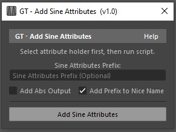

Create Sine attributes without using third-party plugins or expressions.
 Just select and object, then click on "Add Sine Attributes"

 

<b>- Sine Attributes:</b>: The attribute holder will receive custom attributes to control how the stretchy system behaves.
<ul>
	<li><b>Time:</b> Multiplier for the time input (tick)</li>
	<li><b>Amplitude:</b> Wave amplitude (how high it gets)</li>
	<li><b>Frequency:</b> Wave frequency (how often it happens)</li>
	<li><b>Offset:</b> Value added after calculation, offset.</li>
	<li><b>Tick:</b> Time as seen by the sine system.</li>
	<li><b>Output:</b> Result of the sine operation.</li>
	<li><b>Abs Output:</b> Absolute output. (no negative values).</li>
</ul>

Added attributes don't affect your attribute holder in any way, it's up to you do create necessary connections that will determine how these new values will be used. For example, connecting "sideOutput" to "translateY" will case the object to move up and down according to the side curve.

  

<!-- GT Utilities -->

<h1>GT Utilities</h1>

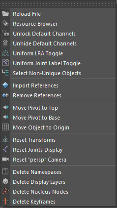

GT Utilities (GTU) is a collection of smaller functions that don't necessary need or use a window/dialog.
 Most of these functions can be found under "GT Tools > Utilities" but a few of them are scattered throughout other menus.

<b>Standalone use: </b>
 In case you're using the standalone version of GT Utilities, you'll have to uncomment one of the functions at the bottom of the script.

<h3>Reload File</h3>

This utility reloads the current Maya file (scene).
 Reloading means re-opening it without attempting to save.
 It only works if the file was saved at least once.

<h3>Open File Directory</h3>

This utility attempts to open the current Maya file directory.
 In case it fails, the path for the file is printed to the script editor.
 It only works if the file was saved at least once.

<h3>Resource Browser</h3>

Opens the resource browser, a menu that allows the used to see what images are available inside Maya and download them.

<h3>Unlock Default Channels</h3>

This function unlocks the translate, rotate, scale and visibility channels for the selected objects.

<h3>Unhide Default Channels</h3>

This function unhides/shows the translate, rotate, scale and visibility channels for the selected objects.

<h3>Unhide Default Channels</h3>

This function unhides/shows the translate, rotate, scale and visibility channels for the selected objects.

<h3>Uniform LRA Toggle</h3>

This utility makes the visibility of the local rotation axis of the selected objects uniform.  For example, if two out of three objects have their LRA visible, it makes all of them visible.

<h3>Convert Joints to Mesh</h3>

Converts selected skeleton to a mesh version of it. Helpful when sending joints into another program that might not support or display joints in the same way Maya does. To use it, select the root joint of your skeleton and run the function. (No need to select all joints, just the root)

<h3>Uniform Joint Label Toggle</h3>

Uniformly toggles the option "Joint > Joint Labelling > Draw Label" (".drawLabel") for all joints in the scene (according to the state of the majority of them).

<h3>Select Non-Unique Objects</h3>

Selects all objects with the same short name. (A short name is the name of the object without its path)

<h3>Full HUD Toggle</h3>

Toggles most of the Heads-Up Display (HUD) options according to the state of the majority of them.  (Keeps default elements ON when toggling it OFF)

<h3>Import References</h3>

Attempts to import all loaded references.

<h3>Remove References</h3>

Attempts to remove all references.

<h3>Move Pivot to Top</h3>

Moves the pivot point of the selected objects to the top of their bounding box.

<h3>Move Pivot to Base</h3>

Moves the pivot point of the selected objects to the base of their bounding box.

<h3>Move Object to Origin</h3>

Moves the selected objects to the center of the grid (0,0,0) origin point.

<h3>Reset Transforms</h3>

Resets translate, rotate and scale back to zero. For example, you can select all controls of a character and reset its pose.
 This pose will not reset translate for joints.

<h3>Reset Joints Display</h3>

Resets the visibility of all joints. It sets the radius of all joints to one. (Unless the channel is locked) and sets the visibility to "On". It also changes the global joint display scale (multiplier) back to one.

<h3>Reset "persp" Camera</h3>

Resets most of the attributes for the default "persp" camera.

<h3>Delete Namespaces</h3>

Merges all namespaces back to the root, essentially deleting them.

<h3>Delete Display Layers</h3>

Deletes all display layers.

<h3>Delete Nucleus Nodes</h3>

Deletes all nodes related to the nucleus system.

<h3>Delete Keyframes</h3>

Deletes all keyframes. (It does not affect set driven keys)

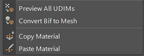

<h3>Preview All UDIMs</h3>

Generates previews for all file nodes using UDIMs.

<h3>Convert Bif to Mesh</h3>

Converts selected Bifrost meshes into the standard Maya meshes. (Bif objects are created using Bifrost Graph)

<h3>Copy Material</h3>

Copies a material from the selection to the clipboard to later be applied to another object.
 It supports components such as faces.

<h3>Paste Material</h3>

Pastes a material to the selection. (Use the Copy Material function to copy it first)
 It supports components such as faces.

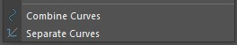

<h3>Combine Curves</h3>

Moves curve shapes of the selected curves into one single transform, essentially combining them.
 In case a bezier curve is found, the script gives you the option of converting them to NURBS.

<h3>Separate Curves</h3>

Parents every curve shape of the selection under a new transform, causing them to be separated.

	 
	 
 

<!-- GT Startup Booster -->

<h1>GT Startup Booster</h1>

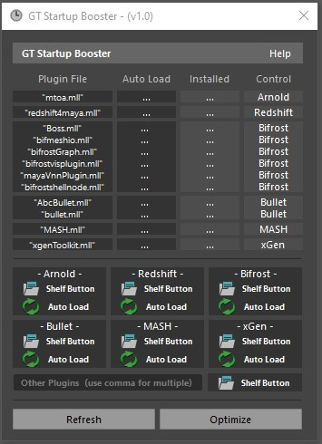

This script helps decrease the time Maya takes to load before becoming fully functional.

<b>How It works: </b>
 Not all plugins are used every time Maya is opened, but they are usually still loaded during startup. This causes the startup time to be quite slow.
 This script aims to fix that, by helping you skip the heavy plugins while still having easy access to them.

1st: Optimize.
 2nd: Create Shelf Buttons.
 3rd: Enjoy faster startups.

<b>Plugin List: </b>
 This is a list of common plugins that are usually automatically loaded by default.
 Plugin File: Name of the file used by the plugin.
 Auto Load: Is this plugin automatically loading?
 Installed: Is the plugin installed?
 Control: General name of the plugin.

<b>"Shelf Button" and "Auto Load" Buttons: </b>
 Shelf Button: Creates a Shelf Button (under the current shelf) to load the plugin and give you feedback on its current state.
 Auto Load: Toggles the Auto Load function of the plugin. (same as "Auto Load" in the plugin manager)

<b>Custom Shelf Button: </b>
 This script couldn't account for every heavy 3rd party plug-in.This shouldn't be an issue as you can manually add any plugin.
 Just manually deactivate your third party plugin by going to "Windows > Settings/Preferences > Plug-in Manager"
 Then create a custom load button using the textField that says "Other Plugins"

 

<!-- GT fSpy Importer -->

<h1>GT fSpy Importer</h1>

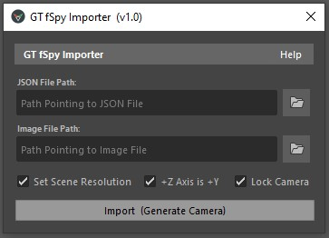

This script allows you import the data of a JSON file (exported out of fSpy) into Maya.

<b>What is fSpy: </b>
 fSpy is a fantastic software that allows you to quickly and easily create a 3D camera match. The files created with it can easily be imported in Blender, but not in Maya. That's what this script aims to address. 
 You can find more information and a tutorial on their website: <a href="https://fspy.io/">https://fspy.io/</a>

<b>How It works: </b>
 Using the JSON file, this script applies the exported matrix to a camera so it matches the position and rotation identified in fSpy.
 It also calculates the focal length assuming that the default camera in Maya is a 35mm camera.

<b>How to use it:</b>
 <b>Step 1:</b> Create a camera match in fSpy. (There is a tutorial about it on their website)
 <b>Step 2:</b> Export the JSON file by going to "File > Export > Camera parameters as JSON".
 <b>Step 3:</b> Load the files by opening the script and entering the path for your JSON and Image files.
 <b>Step 4:</b> Use the Import button to generate the camera.

<b>JSON File Path: </b>
 This is a path pointing to the JSON file you exported out of fSpy. 
In case the file was altered or exported/created using another program it might not work as expected.

<b>Image File Path:</b>
 A path pointing to the image file you used for your camera match with in fSpy. 
Do not change the resolution of the image file or crop the image or it might not work properly.

<b>Set Scene Resolution: </b>
 Uses the size of the image to determine the resolution of the scene. This settings are found under "Render Settings > Image Size" (Resolution)

<b>+Z Axis is +Y: </b>
 Rotates the camera so the default +Z axis becomes +Y.
 This might be necessary in case the default settings were used inside fSpy. This is because different softwares use different world coordinate systems.

<b>Lock Camera </b>
 Locks the generated camera, so you don't accidentally move it.

 

<!-- GT Maya to Discord -->

<h1>GT Maya to Discord</h1>

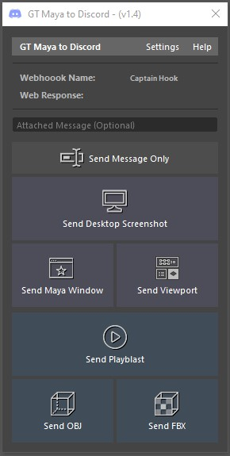

This script allows you to quickly send images and videos (playblasts) from Maya to Discord using a Discord Webhook to bridge the two programs.

<b>Webhooks: </b>
 A webhook (a.k.a. web callback or HTTP push API) is a way for an app to provide other applications with real-time information.
 You can use it to send messages to text channels without needing the discord application.

<b>How to get a Webhook URL: </b>
 If you own a Discord server or you have the correct privileges, you can go to the settings to create a Webhook URL.

<b>To create one go to: </b>
 "Discord > Server > Server Settings > Webhooks > Create Webhook"
 Give your webhook a name and select what channel it will operate.
 Copy the "Webhook URL" and load it in the settings for this script. 
 If you're just an user in the server, you'll have to ask the administrator of the server to provide you with a Webhook URL.

<b>Send Buttons: </b>
 Send Message Only: Sends only the attached message.
 (Use the text-field above the buttons to type your message)

<b>Send Desktop Screenshot: Sends a screenshot of your desktop. </b>
 (This includes other programs and windows that are open)

<b>Send Maya Window: Sends only the main Maya window. </b>
 (This ignores other windows, even within Maya)

<b>Send Viewport: Sends an image of the active viewport. </b>
 (Includes Heads Up Display text, but no UI elements)

<b>Send Playblast: Sends a playblast video. </b>
 (Use the script settings to determine details about the video)

<b>Send OBJ/FBX: Sends a model using the chosen format. </b>
 For settings, go to "File > Export Selection... > Options"

<b>Settings: </b>
 The settings are persistent, which means they will stay the same between Maya sessions.

<b>Custom Username: </b>
 Nickname used when posting content through the webhook.

<b>Image and Video Format: </b>
 Extension used for the image and video files.

<b>Video Options: </b>
 Determines the settings used when recording a playblast.

<b>Feedback and Timestamp Options: </b>
 Determines feedback visibility and timestamp use.

<b>Limitations: </b>
 Discord has a limit of 8MB for free users and 50MB for paid users for when uploading a file.
 If you get the error "Payload Too Large" it means your file exceeds the limits. Try changing the settings.

 

<!-- GT Render Calculator -->

<h1>GT Render Calculator</h1>

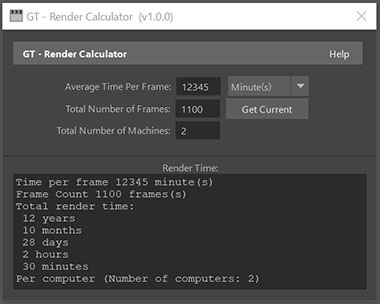

This script helps you calculate the total render time of a task based on how long it takes to render a frame..

<b>Average Time Per Frame: </b>
 Integer describing the average time used to render one frame of your animation. The drop-down menu to the right describes the unit used for the provided number. Seconds, minutes or hours.

<b>Total Number of Frames: </b>
 The total number of frames to be rendered.
 The "Get Current" button uses the timeline to determine how many frames are likely being rendered using the in and out values.

<b>Total Number of Machines: </b>
 The number of computers rendering the same job.
 The render time may vary per machine based on the available setup.

 

</body>
