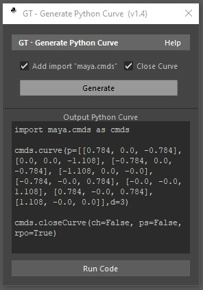

<!-- GT Tools Docs -->

<body>

<!-- Table of Contents -->

<h1> Table of Contents </h1>

<h3><b>General:</b></h3>
<ul>
  <li><a href="#-gt-menu-">GT Menu</a></li>
  <li><a href="#-gt-check-for-updates-">GT Check for Updates</a></li>
</ul>
<h3><b>Tools:</b></h3>
<ul>
  <li><a href="#-gt-renamer-">GT Renamer</a></li>
  <li><a href="#-gt-selection-manager-">GT Selection Manager</a></li>
  <li><a href="#-gt-path-manager-">GT Path Manager</a></li>
  <li><a href="#-gt-color-manager-">GT Color Manager</a></li>
  <li><a href="#-gt-transfer-transforms-">GT Transfer Transforms</a></li>
  <li><a href="#-gt-render-checklist-">GT Render Checklist</a></li>
</ul>
<h3><b>Curves:</b></h3>
<ul>
  <li><a href="#-gt-generate-python-curve-">GT Generate Python Curve</a></li>
  <li><a href="#-gt-generate-text-curve-">GT Generate Text Curve</a></li>
</ul>
<h3><b>Modeling:</b></h3>
<ul>
  <li><a href="#-gt-sphere-types-">GT Sphere Types</a></li>
</ul>

<h3><b>Rigging:</b></h3>
<ul>
  <li><a href="#-gt-auto-biped-rigger-">GT Auto Biped Rigger</a></li>
  <li><a href="#-gt-connect-attributes-">GT Connect Attributes</a></li>
  <li><a href="#-gt-mirror-cluster-tool-">GT Mirror Cluster Tool</a></li>
  <li><a href="#-gt-generate-in-between-">GT Generate In-Between</a></li>
  <li><a href="#-gt-create-auto-fk-">GT Create Auto FK</a></li>
  <li><a href="#-gt-create-ik-leg-">GT Create IK Leg</a></li>
  <li><a href="#-gt-make-ik-stretchy-">GT Make IK Stretchy</a></li>
</ul>
<h3><b>Utilities:</b></h3>
<ul>
  <li><a href="#-gt-utilities-">GT Utilities</a></li>
</ul>
<h3><b>Miscellaneous:</b></h3>
<ul>
  <li><a href="#-gt-startup-booster-">GT Startup Booster</a></li>
  <li><a href="#-gt-fspy-importer-">GT fSpy Importer</a></li>
  <li><a href="#-gt-maya-to-discord-">GT Maya to Discord</a></li>
</ul>

 

<!-- GT Menu -->

<h1> GT Menu </h1>

The script "gt_tools_menu.mel" adds a new dropdown menu to the main Maya window. It provides the user with easy access to the other scripts based on categories. 
 This menu contains sub-menus that have been organized to contain related tools. For example: modeling, rigging, utilities, etc...

<b>How does Maya know to run the script and create the menu?:</b> When you install the script package, it adds a line of code to the "userSetup.mel" file. This file gets executed every time Maya opens.

<b>Help > About: </b> This option opens a window showing basic information about GT Tools.

<b>Help > Re-Build Menu: </b>It re-creates the GT Tools menu, and does a rehash to pick up any new scripts.
 (Good for when updating, so you don't need to restart Maya)

<b>Help > Check for Updates: </b> Opens the script "gt_check_for_updates" to compare your version with the latest release.

<b>Help > Installed Version: </b>What version is currently installed.

 

<!-- GT Check for Updates -->

<h1> GT Check for Updates </h1>

This script compares your current GT Tools version with the latest release from Github. In case the version installed is older than the latest release, an option to update becomes available. In this window you can also control how often the script will automatically check for updates.

<b>Status: </b> Result from the comparison. In case you have an older version it will let you know that the script package can be updated.

<b>Web Response: </b> The script needs to ask Github for the latest release to be able to compare with the one you have. In case internet is not available or a firewall blocked the connection you will see the error code here. (These are HTTP status codes)

<b>Re-Build Menu: </b>It re-creates the GT Tools menu, and does a rehash to pick up any new scripts. (Good for when updating, so you don't need to restart Maya)

<b>Installed Version: </b> Version currently installed on your computer. In case you never installed the menu, it will be (v0.0.0).

<b>Latest Release: </b>Latest version available on Github.

<b>Latest Release Changelog: </b>Here you can find a list showing all the main changes applied to the three latest versions. The version number can be found on the top left corner and the release date on the top right corner.

<b>Auto Check For Updates: </b>This function controls the behaviour of the auto updater. In case active, it will use the interval value to determine if it should check for new releases. The user will only see the update window in case there is an actual update. (This function has no impact in your Maya startup time as it only gets executed only when necessary and it waits for the program to be idle. Click on the button to toggle between Activated/Deactivated

<b>Interval: </b>This is how often the script will auto check for updates. Click on the button to change between the available intervals. (5 day, 15 days, 30 days, 3 months, 6 months, 1 year)

<b>Refresh: </b>Checks for updates again.

<b>Update: </b>This button is only available in case there is a new update available. When clicked it opens the page for you to download the latest version. Simply install it again to update.

 

<!-- GT Renamer -->

<h1> GT Renamer </h1>

Script for quickly renaming multiple objects. Feedback is given through inView messages at the left bottom corner.

<b>Modes: </b> - Selected: uses selected objects when renaming. - Hierarchy: uses hierarchy when renaming. - All: uses everything in the scene (even hidden nodes)

<b>Other Tools: </b> - Remove First Letter: removes the first letter of a name. If the next character is a number, it will be deleted. - Remove Last Letter: removes the last letter of a name. - U-Case: makes all letters uppercase. - Capitalize: makes the 1st letter of every word uppercase. - L-Case: makes all letters lowercase

<b>Rename and Number: </b>Renames selected objects and number them. - Start # : first number when countaing the new names. - Padding : how many zeros before the number. e.g. "001"

<b>Prefix and Suffix: </b> Prefix: adds a string in front of a name. Suffix: adds a string at the end of a name.  - Auto: Uses the provided strings to automatically name objects according to their type or position. 1st example: a mesh would automatically receive "_geo" 2nd example: an object in positive side of X, would automatically receive "left_: .  - Input: uses the provided text as a prefix or suffix.

<b>Search and Replace: </b>Uses the well-known method of search and replace to rename objects.

 

<!-- GT Selection Manager-->

<h1> GT Selection Manager </h1>

This script allows you to update selections to contain (or not) filtered elements. You can also save and load previous selections.
	 

<b>Element Name: </b>This option allows you to check if the string used for the object name contains or doesn't contain the, the provided strings (parameters).

<b>Element Type:  </b>This filter will check the type of the element to determine if it should be part of the selection or not.

<b>Element Type > Behavior (Dropdown Menu): </b>Since most elements are transforms, you can use the dropdown menu "Behavior" to determine how to filter the shape element (usually hidden inside the transform).  (You can consider transform, shape, both or ignore it)

<b>Visibility State: </b>Selection based on the current state of the node's visibility attribute.

<b>Outliner Color (Transform): </b>Filters the option under Node > Display > Outliner Color. In case you're unsure about the exact color, you can use the "Get" button to automatically copy a color.

<b>Store Selection Options: </b> Select objects and click on "Store Selection" to store them for later. Use the "-" and "+" buttons to add or remove elements. Use the "Reset" button to clear your selection.

<b>You can save your selection in two ways: </b> As a set: creates a set containing your selection.  As text: creates a txt file containing  the code necessary to recreate selection.

<b>Create New Selection: </b>Uses all objects as initial selection <b>Update Current Selection: </b>Considers only selected objects

 

<!-- GT Path Manager -->

<h1> GT Path Manager </h1>

	 

This script displays a list with the name, type and path of any common nodes found in Maya.  You can select the node listed by clicking on it or change its name or path by double clicking the cell.

The icon on the left describes the validity of the path. If the file or directory is found in the system it shows a green confirm icon otherwise it shows a red icon.

<b>Auto Path Repair: </b>This function walks through the folders under the provided directory looking for missing files. If it finds a match, the path is updated.

<b>Search and Replace: </b>This function allows you to search and replace strings in the listed paths.

<b>Refresh: </b>Re-populates the list while re-checking for path validity.

<b>Search Path: </b>A directory path used when looking for missing files.

<b>Supported Nodes: </b>
 file (UDIMS and Image Sequences), audio, cacheFile, AlembicNode, BifMeshImportNode, gpuCache, MASH_Audio, aiPhotometricLight, aiStandIn, aiVolume, RedshiftProxyMesh, RedshiftVolumeShape, RedshiftNormalMap, RedshiftDomeLight, RedshiftIESLight, imagePlane

  

<!-- GT Color Manager -->

<h1> GT Color Manager </h1>

Script for quickly coloring elements in Maya. Feedback is given through inView messages at the left bottom corner.

 

<b>Modes: </b> - Drawing Override: Utilize "Object > Object Display > Drawing Overrides" to set color. - Wireframe Color:  Utilize "Display > Wireframe Color..." to set color.

 

<b>Target: </b> - Transform:  Colorize actual selection. Usually a "transform" - Wireframe Color:  Colorize the shape node inside the transform

 

<b>Current Color: </b> The color used in the operation. Click on the color to open Maya's color picker.

<b>Color Presets: </b> A list of common colors. When clicked it sets the color.

<b>Set Color For: </b> - Outliner:  Control the outliner color
 - Wireframe Color:  Control the wireframe color seen in the viewport

     

<!-- GT Transfer Transforms -->

<h1> GT Transfer Transforms </h1>

Script for transfering translate, rotate or scale data from one object to antoher.

<b>Transfer (Source/Targets): </b> 1. Select Source 1st - Wireframe Color:  Utilize "Display > Wireframe Color..." to set color.

<b>Target: </b> - Transform:  Colorize actual selection. Usually a "transform" 2. Select Targets 2nd,3rd... 3. Select which transforms to transfer (or maybe invert)

<b>Transfer from one side to the other: </b> "From Right to Left" and From Left To Right" functions.

1. Select all elements
 2. Select which transforms to transfer (or maybe invert)
 3. Select one of the "From > To" options
 e.g. "From Right to Left" :  Copy transforms from objects
with the provided prefix "Right Side Tag" to objects 
with the provided prefix "Left Side Tag".

<b>Copy and Paste Transforms: </b> This function doesn't take in consideration the previous settings.
It works on its own.  As the name suggests, it copy transforms, which populates the text fields, or it pastes transforms from selected fields back to selected objects.

 

<!-- GT Render Checklist -->

<h1> GT Render Checklist </h1>

This script performs a series of checks to detect common issues that are often accidently ignored/unnoticed.

<b>Checklist: </b>
 - Operation: Name of the check the script will perform
 - Status: Result received from the test
 - Info: Extra info or comments regarding the results

<b>Checklist Status: </b> These are also buttons, you can click on them for extra functions:
 - Grey: Default color, not yet tested.
 - Green: Pass color, no issues were found.
 - Yellow: Warning color, some possible issues were found.
 - Red: Error color, issues were found.
 - Black: Exception color, an issue caused the check to fail. (Likely because of a missing plug-in or unexpected value)
 - Question Mark, click on button for more help.

<b>Settings: </b>
 Change what values cause the script to return a warnings and errors.
 - Apply: Stores the settings and go back to the main window (settings are persistent between Maya sessions)
 - Export Settings: Exports a txt file containing all current settings.
 - Import Settings: Imports a txt file exported using the previously mentioned function.
 - Reset to Default Values: Resets expected values to default values.

<b>Main Buttons: </b>
 - Generate Report: Creates a temporary txt file with all the information collected during the checks.
 - Refresh: Runs all checks again.

<b>Checklist Operations:</b>

<ul>
	<li> Frame Rate: returns error if not matching expected frame rate, for example "film" (24fps).
		 Examples of custom values:"film" (24fps),"23.976fps", "ntsc" (30fps), "ntscf" (60fps), "29.97fps"
	</li>
	<li> Scene Units: returns error if not matching expected value, for example "cm".
		 Examples of custom values: "mm" (milimeter), "cm" (centimeter), "m" (meter).
	</li>
	<li> Output Resolution: returns error if not matching expected value, for example : ['1920', '1080'].
		 Please use a comma "," for entering a custom value. Examples of custom values: "1280, 720" (720p), "1920, 1080" (1080p), "2560, 1440" (1440p), "3840, 2160" (4K), "7680, 4320" (8K)
	</li>
	<li> Total Texture Count: error if more than expected value 50 (default value) and a warning if more than 40 (default value). (UDIM tiles are counted as individual textures)
	</li>
	<li> Network File Paths: must start with ['path']. Path is a list, you can enter all acceptable locations (usually in the network for render farms)
		 This function completely ignore slashes. You may use a list as custom value. Use a comma "," to separate multiple paths.
	</li>
	<li> Network Reference Paths: must start with ['path']. Path is a list, you can enter all acceptable locations (usually in the network for render farms)
		 This function completely ignore slashes. You may use a list as custom value. Use a comma "," to separate multiple paths
	</li>
	<li> Unparented Objects: returns an error if common objects are found outside hierarchies. For example a cube outside of a group.</li>
	<li> Total Triangle Count: : error if more than 2000000 (default value) warning if more than: 1800000 (default value).
	</li>
	<li> Total Poly Object Count: error if more than 100 (default value) warning if more than 90 (default value).
	</li>
	<li> Shadow Casting Lights: error if more than 3 (default value) warning if more than 2 (default value).
	</li>
	<li> RS Shadow Casting Lights: error if more than 4 (default value) warning if more than 3(default value).
	</li>
	<li> Ai Shadow Casting Lights: error if more than 4 (default value) warning if more than 3 (default value).
	</li>
	<li> Default Object Names: error if using default names. Warning if containing default names. 
		 Examples of default names: "pCube1" = Error, "pointLight1" = Error, "nurbsPlane1" = Error, "my_pCube" = Warning
	</li>
	<li> Objects Assigned to lambert1: error if anything is assigned to the default shader "lambert1".
	</li>
	<li> Ngons: error if any ngons are found. (A polygon that is made up of five or more vertices. Anything over a quad (4 sides) is considered an ngon)
	</li>
	<li> Non-manifold Geometry: error if is found. A non-manifold geometry is a 3D shape that cannot be unfolded into a 2D surface with all its normals pointing the same direction.
		 For example, objects with faces inside of it or faces with edges extruded out of it.
	</li>
	<li> Empty UV Sets: error if multiples UV Sets and Empty UV Sets. It ignores objects without UVs if they have only one UV Set.
	</li>
	<li> Frozen Transforms: error if rotation(XYZ) not frozen. It doesn't check objects with incoming connections, for example, animations or rigs.
	</li>
	<li> Animated Visibility: error if animated visibility is found warning if hidden object is found.
	</li>
	<li> Non Deformer History: error if any non-deformer history found.
	</li>
	<li> Textures Color Space: error if incorrect color space found. It only checks commonly used nodes for Redshift and Arnold
		 Generally "sRGB" -> float3(color), and "Raw" -> float(value).
	</li>
	<li> Other Network Paths: must start with ['path']. Path is a list, you can enter all acceptable locations (usually in the network for render farms)
		 This function completely ignore slashes. You may use a list as custom value. Use a comma "," to separate multiple paths.
		 This function checks: Audio Nodes, Mash Audio Nodes, nCache Nodes, Maya Fluid Cache Nodes, Arnold Volumes/Standins/Lights, Redshift Proxy/Volume/Normal/Lights, Alembic/BIF/GPU Cache, Golaem Common and Cache Nodes.
	</li>
</ul>
 

<!-- GT Generate Python Curve -->

<h1> GT Generate Python Curve </h1>

This script generates the Python code necessary to create a selected curve. Helpful for when you want to save a curve to your shelf or to add it to a script.

<b>How to use it:</b>
 1. Make sure you delete the curve's history before generating the code.
 2. Select the curve you want to convert to code.
 3. Click on the "Generate" button to generate the code.

<b>Add import "maya.cmds": </b> Adds a line that imports Maya's cmds API. This is necessary for when running python scripts.

<b>Close Curve: </b> Adds a line to close the curve after creating it.

<b>"Generate" button:</b> Outputs the python code necessary to create the curve inside the "Output PYthon Curve" box.

<b>Run Code: </b> Attempts to run the code (or anything written) inside  "Output Python Curve" box  

 

<!-- GT Generate Text Curve -->

<h1> GT Generate Text Curve </h1>

This script creates merged curves containing the input text from the text field.  (All shapes go under one transform)

<b>How to use it:</b>
 1. Select what font you want to use.
 2. Type the word you want to create in the "Text:" text field.
 3. Click on the "Generate" button.

You can create multiple curves at the same time by separanting them with commas ",".

<b>Current Font: </b> Click on the button on its right to change the font

 

<!-- GT Sphere Types -->

<h1> GT Sphere Types </h1>

Quite simple script used as a reminder that the standard sphere is not the only sphere option.

<b>Standard Sphere: </b> Creates the standard Maya sphere. "Create > Polygon Primitives > Sphere"

<b>Standard Sphere: </b> Creates a sphere using a cube. "Create > Polygon Primitives > Cube" then "Mesh > Smooth (2x)"

<b>Platonic Sphere A: </b> Creates a sphere using a platonic solid. (Settings: Icosahedron, Quads, 1, 1, 1)

<b>Platonic Sphere A: </b> Creates a sphere using a platonic solid. (Settings: Octaheadron, Quads, 2, 1, 1)

 

<!-- GT Auto Biped Rigger -->

<h1> GT Auto Biped Rigger </h1>

Script for quickly generating an advanced biped rig.
 For more predictable results execute the script in a new scene containing only the geometry of the desired character. This prevents naming conflicts and data loss.

Here are some highlights of what it creates: 
 - FK/IK switches with automated control visibility 
 - Automated finger posing with offset (for a natural motion) 
 - Foot rolls (with manual limiters for more flexibility) 
 - Options to have pole vectors, IK controls and eyes follow parts of the body (like effectors) 
 - Stretchy and squash for the arms and legs (with automatic volume preservation) 
 - Automatic forearm rotation with support for stretched limbs.
 - Shelf button with Seamless FK/IK Switch for arms and legs.
 - Automatic HumanIK character definition with custom rig profiles for retargeting (mocap)

<h3>Step 1:</h3>
<b>- Create Proxy:</b> 
This button will create many temporary curves that will later be used to generate the rig. 
 In case you want to re-scale the proxy, use the root proxy control for that.
 The initial scale is the average height of a woman (160cm) but you can download proxy presets (poses) for other scales from the  <a href="./assets">assets folder</a>.
 
  The arrow found in the shape of the clavicles, hands and finger proxies indicate their up position. 
 The bigger arrows in the shape of the knees and elbows show the direction of their up vector constraint. (that's the direction they will bend)
 
 To position the eye proxies: Center the pivot point of the eye geometry then display its Local Rotation Axes then snap the proxy to its center.
 To center the pivot of eye geometry go to <b>"Modify > Center Pivot"</b> (It's often already in the center, check it first)
 To show the Local Rotation Axes (so you have a point to snap it to) go to <b>"Display > Transform Display > Local Rotation Axes"</b>
 Hold "V" while moving the eye proxy to snap it to points. 
 
 Some proxy curves have custom attributes on them that allow you to tweak their posing behavior or visibility. 
 The ankle proxy curves have an attribute called "Follow Hip" when activated, they will follow the position of the hip allowing you to pose the character a bit faster while keeping a hip and ankle perfectly aligned.
 The Root proxy has an attribute called "Lines Visibility" that allows you to turn off the visibility of the lines
 
 Proxy curves are not joints. Please don't delete or rename them. 
 For tips on how to position every proxy curve, open the attribute editor and read the information under "Transform Node > Notes:"

<h3>Step 2:</h3>
Pose the proxy (guide) to match your character. 
 <b>- Reset Proxy:</b>  Resets the position and rotation of the proxy elements, essentially "recreating" the proxy.  
 <b>- Mirror Right to Left:</b> Copies the transform data from the right side to the left side, mirroring the pose.
 <b>- Mirror Left to Right:</b> Copies the transform data from one left side to the right side, mirroring the pose.
 <b>- Import Pose:</b> Imports a JSON file containing the transforms of the proxy elements. This file is generated  using the "Export Pose" function. 
 <b>- Export Pose:</b> Exports a JSON file containing the transforms of the proxy elements. 
 <b>- Delete Proxy:</b> Simply deletes the proxy in case you no longer need it.

<h3>Step 3:</h3>
<b>- Create Rig:</b> This button uses the proxy elements to automatically create the control rig.
 It uses the transform data found in the proxy to determine how to position, orient and setup the skeleton and controls.
 This function will delete the proxy. Make sure you export it first if you plan to reuse it later. 

<h3>Step 4:</h3>
Now that the rig has been created,  it's time to to attach it to the geometry.
 <b>- Select Skinning Joints:</b>  Select only joints that should  be used when skinning the character. This means that it will not include end or toe joints. If you don't plan to include the eyes joints in the influences of the character's body, simply unselect them before skinning.
 <b>- Bind Skin Options:</b>  Opens the options for the function "Bind Skin" so the desired geometry can attached to the skinning joints. Make sure to set the option "Bind to" as "Selected Joints" to guarantee that only the desired joints are part of the influence. 

 

<h3>Utilities:</h3>

These are utilities and extra functions that you can use after creating your rig.
 
 <b>- Add Seamless FK/IK Switch to Shelf:</b>  Adds a new button to your current shelf. This button allows the animator to seamlessly switch between FK and IK for the arms and legs.
 <b>		- Toggle:</b> Seamlessly Toggles between FK and IK. 
 <b>		- FK to IK:</b> Switches to IK and copies the FK pose into it. 
 <b>		- IK to FK:</b> Switches to FK and copies the IK pose into it.
 
 <b>- Toggle Label Visibility:</b> Uniformly toggles the option "Joint > Joint Labelling > Draw Label" (".drawLabel") for all joints in the scene (according to the state of the majority of them).
 
 <b>- Attach to HumanIK:</b> Automatically creates a HumanIK character definition called "auto_biped" and assign all the available joints/bones to it. In case a character with the same name is already present in the scene, it will be overwritten.

 
<h3>Example of seamless FK/IK switch being used:</h3>

  <h3>How to attach motion capture data to the rig through HumanIK:</h3>
<b>- 1.</b> Start by defining a character and assigning all bones to the definition (You can do that in one click using the utility "Attach to HumanIK")
 <b>2.</b> Create a custom rig by clicking on the custom rig button. 
 <b>3.</b> Assign the desired controls or use one of the provided templates so HumanIK knows what controls to update. 
 You can load a template by clicking on the button "Load Custom Rig Mapping".  Templates can be found in the <a href="./assets">assets folder</a>.
 <b>4.</b> Now you can source the motion from another character like you would normally do in HumanIK and it should automatically reverse engineer the control position to match the mocap data.
 In case the elbows or knees pole vector controls give you trouble, you might be able to fix it using their custom attribute "Follow Foot" or "Follow Wrist" instead of relying on HumanIK to position it. <a href="https://youtu.be/eBwYi8FeK3I">This video</a> explains in more details how this process works.
 <b>5.</b> Now you can bake the movements to the custom rig by going to "HumanIK Button (blue button) > Bake > Bake to Custom Rig".
 Feel free to delete the HumanIK character definition and mocap data after that as the keyframes are now already baked to the controls.

<h3>Custom Attributes and Stretchy System:</h3>

This rig comes with many custom attributes so you can tweak how much stability/flexibility you want and how the systems should behave.
<b>- Lock Attribute</b> Many controls come with channels automatically locked so they behave in an expected way, but in certain situations you might want to unlock these so you have more flexibity. For this, you can just change the "Lock Channel" (Channel could be Translate, Rotate, XY and Z) custom attribute. A good example is the foot rolls. They have their Y and Z rotations locked by default, but in case you want to rotate the foot in another diretion you can change "Lock YZ" to "Off". 

 

<!-- GT Connect Attributes -->

<h1> GT Connect Attributes </h1>

This script automates the creation of connections between attributes from source (output) and target (input).

<b>Use Selection for Source and Target (s): </b>
 When this option is activated, you no longer need to load sources/target (s).
 You can simply select: 1st: source, 2nd, 3rd... : target(s)

<b>Add Reverse Node:  </b> Adds a reverse node between connections.

<b>Disconnect: </b> Break connections between selected nodes.

<b>Force Connection (Overrides Existing): </b> Connects nodes even if they already have a connection.

<b>Add Custom Node Between Connection: </b>
 Allows user to create a node between connections. (Excellent for controlling dataflow.)
 -Custom Node: Which node to create
 -Add Input Node: Creates one master control to update all in betweens.

<b>Load Source/Target Objects: </b>
 Use these buttons to load the objects you want to use as source and target (s).

<b>Source Attribute and Target Attributes: </b>
 Name of the attribute you want to connect.  Requirement: Use long or short name (no nice names)

<b>List All Attributes and List Keyable Attributes: </b>
 Returns a list of attributes that can be used to populate the Source and Target Attributes fields.

 

<!-- GT Mirror Cluster Tool -->

<h1> GT Mirror Cluster Tool </h1>

Script for mirroring clusters on mesh objects.

<b>Step 1: </b>
 Load your mesh by selecting it in the viewport or in the outliner,  then click on "Select Mesh".
 Requirements: Must be one single mesh transform.

<b>Step 2: </b>
 Load your clusterHandle by selecting it in the viewport or in the outliner,  then click on "Select Cluster".
 Requirements: Must be one single clusterHandle.

<b>Step 3: </b>
 Select your mirror axis X, Y or Z. It will always mirror on the negative direction

<b>Step 4: </b>
 To save time you can automatically rename the mirrored clusters using the search and replace text fields.
 For example search for "left_" and replace with "right_"

 

<!-- GT Generate In-Between -->

<h1> GT Generate In-Between </h1>

This script creates a inbetween transform for the selected elements.

<b>Layer Type: </b>
 This pull-down menu determines what type object will be created.

<b>Parent Type: </b>
 This pull-down menu determines where the pivot point of the generated element will be extracted from.

<b>Outliner Color: </b>
 Determines the outliner color of the generated element.

<b>New Transform Suffix: </b>
 Determines the suffix to be added to generated transforms.

 

<!-- GT Create Auto FK -->

<h1> GT Create Auto FK </h1>

This script generates FK controls for joints while storing their transforms in groups.
 Just select the desired joints and run the script.

<b>Colorize Controls: </b>
 Automatically colorize controls according to their names (prefix). It ignores uppercase/lowercase.
 No Prefix = Yellow
 "l_" or "left_" = Blue
 "r_" or "right_" = Red

<b>Select Hierarchy:  </b>
 Automatically selects the rest of the hierarchy of the selected object, thus allowing you to only select the root joint before creating controls.

<b>(Advanced) Custom Curve: </b>
 You can change the curve used for the creation of the controls. Use the script "GT Generate Python Curve" to generate the code you need to enter here.

<b>Joint, Control, and Control Group Tag: </b>
 Used to determine the suffix of the elements.
 Joint Tag is removed from the joint name for the control.
 Control Tag is added to the generated control.
 Control Group Tag is added to the control group.
 (The control group is the transform carrying the transforms of the joint).

<b>Ignore Joints Containing These Strings:  </b>
 The script will ignore joints containing these strings. To add multiple strings use commas - ",".

 

<!-- GT Create IK Leg -->

<h1> GT Create IK Leg </h1>

This script is no longer part of the GT Tools Menu, I've temporarily removed it so I can make it more user-friendly.  This script assumes that you are using a simple leg composed of a hip joint, a knee joint an ankle joint and maybe ball and toe joints. In case your setup is different, I suggest you try a different solution. 

<b>Joint Tag (Suffix) and Ctrl Group Tag (Suffix): </b>
 These two textfields allow you to define what suffix you used for you base skeleton joints and your control groups. 
 (used when creating new names or looking for controls)
 The Ctrl Group Tag is used to define the visibility of the FK system.

<b>Custom PVector Ctrl, IK Ctrl and IK Switch:  </b>
 These options allow you to load an already existing control.
 In case you already created curve you could simply load them and the script will use yours instead of creating a new one.

<b>Colorize Controls:  </b>
 This option looks for "right_" and "left_" tags and assign colors based on the found tag.

<b>Make Stretchy Legs: </b>
 This option creates measure tools to define how to strechy the leg when it goes beyong its current size.
 - Term = What is being compared
 - Condition = Default Size (used for scalling the rig)

<b>Use Ball Joint:  </b>
 This option allows you to define whether or not to use a ball joint.

<b>Load "Content" Buttons:  </b>
 These buttons allow you to load the necessary objects before running the script.

 

<!-- GT Make Stretchy Legs -->

<h1> GT Make IK Stretchy </h1>

This script makes an IK setup stretchy.
 Load an ikHandle, then click on "Make Stretchy"

<b>Stretchy System Prefix:</b>
 As the name suggests, it determined the prefix used when naming nodes for the stretchy system. If nothing is provided, it will be automatically named "temp".

<b>Load IK Handle:</b>
 Use this button to load your ikHandle.The joints will be automatically extracted from it.

<b>Load Attribute Holder:</b>
 Use this button to load your attribute holder.
 This is usually a control. A few custom attributes will be added to this object, so the user can control the stretchy system.

<b>Important:</b>
 The ikHandle cannot be outside of a group. So it will be automatically grouped when this is the case.
 If an attribute holder is not provided, a simpler version of the stretchy system will be created instead.

  

<!-- GT Utilities -->

<h1> GT Utilities </h1>

	 

GT Utilities (GTU) is a collection of smaller functions that don't necessary need or use a window/dialog.
 Most of these functions can be found under "GT Tools > Utilities" but a few of them are scattered throughout other menus.

<b>Standalone use: </b>
 In case you're using the standalone version of GT Utilities, you'll have to uncomment one of the functions at the bottom of the script.

<h3>Reload File</h3>

This utility attempts to reload the current scene.
 Realoading means reopening it without attempting to save it first.
 It only works if the file was saved at least once.

<h3>Resource Browser</h3>

Opens the resource browser, a menu that allows the used to see what images are available inside Maya and download them.

<h3>Unlock Default Channels</h3>

This function unlocks the translate, rotate, scale and visibility channels for the selected objects.

<h3>Unhide Default Channels</h3>

This function unhides/shows the translate, rotate, scale and visibility channels for the selected objects.

<h3>Unhide Default Channels</h3>

This function unhides/shows the translate, rotate, scale and visibility channels for the selected objects.

<h3>Uniform LRA Toggle</h3>

This utility makes the visibility of the local rotation axis of the selected objects uniform.  For example, if two out of three objects have their LRA visible, it makes all of them visible.

<h3>Uniform Joint Label Toggle</h3>

Uniformly toggles the option "Joint > Joint Labelling > Draw Label" (".drawLabel") for all joints in the scene (according to the state of the majority of them).

<h3>Import References</h3>

Attempts to import all loaded references.

<h3>Remove References</h3>

Attempts to remove all references.

<h3>Move Pivot to Top</h3>

Moves the pivot point of the selected objects to the top of their bounding box.

<h3>Move Pivot to Base</h3>

Moves the pivot point of the selected objects to the base of their bounding box.

<h3>Move Object to Origin</h3>

Moves the selected objects to the center of the grid (0,0,0) origin point.

<h3>Reset Transforms</h3>

Resets translate, rotate and scale back to zero. For example, you can select all controls of a character and reset its pose.

<h3>Reset Joints Display</h3>

Resets the visibility of all joints. It sets the radius of all joints to one. (Unless the channel is locked) and sets the visibility to "On". It also changes the global joint display scale (multiplier) back to one.

<h3>Reset "persp" Camera</h3>

Resets most of the attributes for the default "persp" camera.

<h3>Delete Namespaces</h3>

Merges all namespaces back to the root, essentially deleting them.

<h3>Delete Display Layers</h3>

Deletes all display layers.

<h3>Delete Nucleus Nodes</h3>

Deletes all nodes related to the nucleus system.

<h3>Delete Keyframes</h3>

Deletes all keyframes. (It does not affect set driven keys)

<h3>Convert Bif to Mesh</h3>

Converts selected Bifrost meshes into the standard Maya meshes. (Bif objects are created using Bifrost Graph)

<h3>Copy Material</h3>

Copies a material from the selection to the clipboard to later be applied to another object.
 It supports components such as faces.

<h3>Paste Material</h3>

Pastes a material to the selection. (Use the Copy Material function to copy it first)
 It supports components such as faces.

	 
<h3>Combine Curves</h3>

Moves curve shapes of the selected curves into one single transform, essentially combining them.
 In case a bezier curve is found, the script gives you the option of converting them to NURBS.

<h3>Separate Curves</h3>

Parents every curve shape of the selection under a new transform, causing them to be separated.

	 
	 
 

<!-- GT Startup Booster -->

<h1> GT Startup Booster </h1>

This script helps decrease the time Maya takes to load before becoming fully functional.

<b>How It works: </b>
 Not all plugins are used every time Maya is opened, but they are usually still loaded during startup. This causes the startup time to be quite slow.
 This script aims to fix that, by helping you skip the heavy plugins while still having easy access to them.

1st: Optimize.
 2nd: Create Shelf Buttons.
 3rd: Enjoy faster startups.

<b>Plugin List: </b>
 This is a list of common plugins that are usually automatically loaded by default.
 Plugin File: Name of the file used by the plugin.
 Auto Load: Is this plugin automatically loading?
 Installed: Is the plugin installed?
 Control: General name of the plugin.

<b>"Shelf Button" and "Auto Load" Buttons: </b>
 Shelf Button: Creates a Shelf Button (under the current shelf) to load the plugin and give you feedback on its current state.
 Auto Load: Toggles the Auto Load function of the plugin. (same as "Auto Load" in the plugin manager)

<b>Custom Shelf Button: </b>
 This script couldn't account for every heavy 3rd party plug-in.This shouldn't be an issue as you can manually add any plugin.
 Just manually deactivate your third party plugin by going to "Windows > Settings/Preferences > Plug-in Manager"
 Then create a custom load button using the textField that says "Other Plugins"

 

<!-- GT fSpy Importer -->

<h1> GT fSpy Importer </h1>

This script allows you import the data of a JSON file (exported out of fSpy) into Maya.

<b>What is fSpy: </b>
 fSpy is a fantastic software that allows you to quickly and easily create a 3D camera match. The files created with it can easily be imported in Blender, but not in Maya. That's what this script aims to address. 
 You can find more information and a tutorial on their website: <a href="https://fspy.io/">https://fspy.io/</a>

<b>How It works: </b>
 Using the JSON file, this script applies the exported matrix to a camera so it matches the position and rotation identified in fSpy.
 It also calculates the focal length assuming that the default camera in Maya is a 35mm camera.

<b>How to use it:</b>
 <b>Step 1:</b> Create a camera match in fSpy. (There is a tutorial about it on their website)
 <b>Step 2:</b> Export the JSON file by going to "File > Export > Camera parameters as JSON".
 <b>Step 3:</b> Load the files by opening the script and entering the path for your JSON and Image files.
 <b>Step 4:</b> Use the Import button to generate the camera.

<b>JSON File Path: </b>
 This is a path pointing to the JSON file you exported out of fSpy. 
In case the file was altered or exported/created using another program it might not work as expected.

<b>Image File Path:</b>
 A path pointing to the image file you used for your camera match with in fSpy. 
Do not change the resolution of the image file or crop the image or it might not work properly.

<b>Set Scene Resolution: </b>
 Uses the size of the image to determine the resolution of the scene. This settings are found under "Render Settings > Image Size" (Resolution)

<b>+Z Axis is +Y: </b>
 Rotates the camera so the default +Z axis becomes +Y.
 This might be necessary in case the default settings were used inside fSpy. This is because different softwares use different world coordinate systems.

<b>Lock Camera </b>
 Locks the generated camera, so you don't accidenty move it.

 

<!-- GT Maya to Discord -->

<h1> GT Maya to Discord </h1>

This script allows you to quickly send images and videos (playblasts) from Maya to Discord using a Discord Webhook to bridge the two programs.

<b>Webhooks: </b>
 A webhook (a.k.a. web callback or HTTP push API) is a way for an app to provide other applications with real-time information.
 You can use it to send messages to text channels without needing the discord application.

<b>How to get a Webhook URL: </b>
 If you own a Discord server or you have the correct privileges, you can go to the settings to create a Webhook URL.

<b>To create one go to: </b>
 "Discord > Server > Server Settings > Webhooks > Create Webhook"
 Give your webhook a name and select what channel it will operate.
 Copy the "Webhook URL" and load it in the setttings for this script. 
 If you're just an user in the server, you'll have to ask the administrator of the server to provide you with a Webhook URL.

<b>Send Buttons: </b>
 Send Message Only: Sends only the attached message.
 (Use the textfield above the buttons to type your message)

<b>Send Desktop Screenshot: Sends a screenshot of your desktop. </b>
 (This includes other programs and windows that are open)

<b>Send Maya Window: Sends only the main Maya window. </b>
 (This ignores other windows, even within Maya)

<b>Send Viewport: Sends an image of the active viewport. </b>
 (Includes Heads Up Display text, but no UI elements)

<b>Send Playblast: Sends a playblast video. </b>
 (Use the script settings to determine details about the video)

<b>Send OBJ/FBX: Sends a model using the chosen format. </b>
 For settings, go to "File > Export Selection... > Options"

<b>Settings: </b>
 The settings are persistent, which means they will stay the same between Maya sessions.

<b>Custom Username: </b>
 Nickname used when posting content through the webhook.

<b>Image and Video Format: </b>
 Extension used for the image and video files.

<b>Video Options: </b>
 Determines the settings used when recording a playblast.

<b>Feedback and Timestamp Options: </b>
 Determines feedback visibility and timestamp use.

<b>Limitations: </b>
 Discord has a limit of 8MB for free users and 50MB for paid users for when uploading a file.
 If you get the error "Payload Too Large" it means your file exceeds the limits. Try changing the settings.

 

</body>
